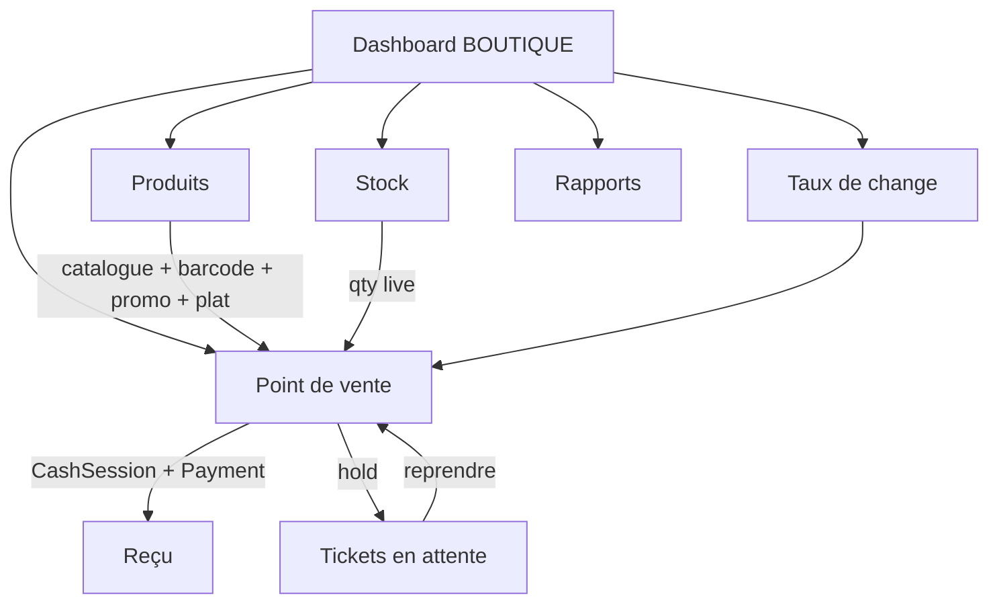
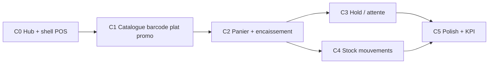

# Plan — Commerce · Point de vente · Panier rapide (branche BOUTIQUE)

**Produit :** Coccinelle  
**Date :** 11 août 2026  
**Statut :** `done` — MVP C0→C5 livré (11 août 2026)  
**Périmètre :** Branche `BranchType = BOUTIQUE` (verticales Pharmacie · Boutique · Alimentation)  
**UX canonique :** **pas de sidebar** — tout part du **Dashboard** via des **cartes**.  
**Unit liée :** [`units-branches/B11-boutique-mvp.md`](./units-branches/B11-boutique-mvp.md)

**Liens :**
- Modules / flags commerce : [`plan-agence-boutique-modules.md`](./plan-agence-boutique-modules.md)
- Code-barres F&B (référence à réutiliser) : [`plan-barcode-produits-pos.md`](./plan-barcode-produits-pos.md)
- Caisse hôtel / vente rapide (pattern UX) : [`plan-hotel-caisse-sejours-restauration.md`](./plan-hotel-caisse-sejours-restauration.md)
- Dashboard dynamique : [`units-branches/PLAN-dashboard-dynamique.md`](./units-branches/PLAN-dashboard-dynamique.md)
- Structure modules : [`units-branches/STRUCTURE-modules-branche.md`](./units-branches/STRUCTURE-modules-branche.md)
- Vision multi-branches : [`plan-multi-branches.md`](./plan-multi-branches.md)

---

## 1. Vision

Sur une branche **Commerce** (Pharmacie, Boutique générale, Alimentation — ou combinaison), le vendeur doit encaisser **vite**, comme à un comptoir d’alimentation :

1. **Une seule porte d’entrée vente** — la carte **Point de vente** remplace « Caisse & Ventes » pour tout ticket / panier.
2. **Scan + recherche** — USB wedge (code-barres) ou saisie nom / SKU → **+1 ligne panier** immédiat.
3. **Panier = ticket papier** — quantités ±, total live, modes paiement, reçu imprimable.
4. **Mise en attente** — client « je reviens » ou « j’ajoute encore » → panier **parké** ; le vendeur enchaîne un autre client ; reprise du ticket en 1 tap.
5. **Client optionnel** — à l’encaissement : nom et/ou téléphone ; sinon **client anonyme** (numéro généré, ex. `ANON-…`).
6. **Promotion par produit** — prix réduit **activable / désactivable** sur la fiche produit ; le POS applique automatiquement le prix promo.
7. **Type produit Article | Plat** — disponible pour **toutes** les verticales (Pharmacie, Boutique, Alimentation) ; un plat se vend comme un article (scan / grille / stock).

### Améliorations retenues

| Idée brute | Décision | Pourquoi |
|------------|----------|----------|
| Deux cartes « Caisse » + « POS » | **Retirer « Caisse & Ventes »** du hub BOUTIQUE ; session caisse ouverte **depuis le POS** (bandeau / gate) | Une intention = vendre ; pas de détour |
| Vente rapide hôtel | **Réutiliser** `PosTerminal` / `useBarcodeScanField` / patterns CashSession + Payment, **catalogue = `ShopProduct`** | Même UX, autre domaine |
| Orientation alimentation | UX **vitesse** : focus scan permanent, gros chiffres, peu de clics, catégories en chips, hold visible | File clients au comptoir |
| Client obligatoire | **Optionnel** ; défaut anonyme | Ne pas freiner la caisse |
| Commande en attente | Entité **`ShopSale` / ticket** avec statut `EN_ATTENTE` (persistée, pas seulement mémoire navigateur) | Survît refresh ; multi-vendeur / reprise |
| Remise au ticket | **Promo sur le produit** (toggle + prix promo), pas de coupon global V1 | Simple, traçable, zéro friction caisse |
| Plats seulement alim. | Type **`ARTICLE` \| `PLAT`** sur **tout** `ShopProduct`, toutes verticales | Même modèle catalogue ; filtre chip « Plats » au POS |

---

## 2. Principes UX (non négociables)

1. **Dashboard-first** — cartes hub BOUTIQUE uniquement.
2. **Point de vente = cœur** — toute vente (scan, panier, hold, encaissement, reçu) part de `…/boutique/pos`.
3. **Session caisse obligatoire** — pas d’encaissement sans `CashSession OPEN` (B08) ; ouverture possible *inline* sur le POS.
4. **Scan-first** — le champ code-barres / recherche a le focus dès l’ouverture ; chaque scan valide = **+1**.
5. **Hold sans friction** — « Mettre en attente » en ≤ 2 actions (libellé optionnel du ticket).
6. **Client à la fin** — dialogue post-panier / pré-paiement ; skip = anonyme.
7. **Retour hub** toujours visible.

### Cartes Dashboard BOUTIQUE (cible)

| Carte | Route | Qui | Intention |
|-------|-------|-----|-----------|
| **Point de vente** *(primary)* | `…/boutique/pos` | Vendeur / caissier | Panier, hold, encaisser, reçu |
| ~~Caisse & Ventes~~ | — | — | **Supprimée** du hub commerce |
| **Produits** | `…/boutique/produits` | Manager / vendeur | Catalogue, type Article/Plat, prix, **promo**, codes-barres, SKU |
| **Stock** | `…/boutique/stock` | Manager | Niveaux, entrées / sorties, alertes |
| **Taux de Change** | `…/taux-change` | Manager / caissier | Devises branche |
| **Tableau de Bord** / rapports | `…/rapports/…` | Owner | CA jour, tickets, ruptures |

> Session caisse + historique paiements du jour restent **accessibles dans le POS** (drawer / onglet secondaire), pas via une carte hub séparée.



---

## 3. Verticales commerce (rappel)

`BranchType` reste **`BOUTIQUE`**. Les cases sont des **flags** (au moins un) :

| Case | Flag | Nuance UX V1 |
|------|------|----------------|
| Pharmacie | `hasPharmacie` | Catégories / seeds pharmacie ; même POS ; **Article + Plat** |
| Boutique | `hasShop` | Catalogue général ; **Article + Plat** |
| Alimentation | `hasAlimentation` | **Référence UX** vitesse ; plats préparés fréquents ; **Article + Plat** |

**V1 :** une seule UI POS pour toutes les verticales (labels / seeds différenciés).  
**Type produit** (`ARTICLE` | `PLAT`) et **promo** : mêmes champs pour **tous** les cas.  
**V1.1 éventuel :** filtres catégories par verticale, champs métier pharmacie (lot / péremption) hors scope MVP.

Helpers existants : `lib/branch/agency-shop.ts` (`ShopVertical`, `deriveShopFlags`, …).

---

## 4. Domaine métier

### 4.1 Catalogue & stock

| Entité | Rôle | Évolution MVP |
|--------|------|----------------|
| `ShopCategory` | Rayon / famille | OK tel quel (+ filtre vertical optionnel plus tard) |
| `ShopProduct` | Article **ou plat** vendable | `kind`, `barcode?`, `imageUrl?`, champs **promo**, unicité barcode par branche |
| Mouvements stock | Traçabilité | Nouveau : `ShopStockMovement` (ENTREE / SORTIE / AJUSTEMENT) lié vente ou réception |

#### Type produit — Article | Plat (toutes verticales)

```text
enum ShopProductKind {
  ARTICLE   // produit standard (SKU, rayon, pharmacie, emballage…)
  PLAT      // plat / préparation / formule vendue à l’unité
}
```

| Règle | Détail |
|-------|--------|
| Portée | Champ sur **chaque** `ShopProduct`, flags Pharmacie / Boutique / Alimentation |
| POS | Chip filtre **Tous · Articles · Plats** (en plus des catégories) |
| Stock | Même logique qty pour Article et Plat (1 plat = 1 unité stock) |
| Seeds | Alimentation : au moins 1–2 plats démo ; autres verticales : kind défaut `ARTICLE` |

#### Promotion produit (prix réduit activable)

Promo **par produit**, gérée depuis la carte **Produits** (édition fiche) — pas de moteur de coupons V1.

| Champ | Type | Règle |
|-------|------|--------|
| `price` | Float | Prix catalogue (toujours conservé) |
| `promoActive` | Boolean | Défaut `false` — toggle ON/OFF |
| `promoPrice` | Float? | Obligatoire si `promoActive` ; doit être **< `price`** et ≥ 0 |
| `promoLabel?` | String? | Ex. « −20 % », « Promo week-end » (badge POS / reçu) |
| `promoStartsAt?` / `promoEndsAt?` | DateTime? | Optionnel V1 ; si renseigné, actif seulement dans la fenêtre **et** `promoActive` |

**Prix effectif POS / ticket**

```text
effectivePrice = promoActive && promoPrice != null
  && (dans fenêtre dates si présentes)
  ? promoPrice
  : price
```

**UX fiche Produits (modifier pour promo)**

1. Ouvrir / éditer un produit (Article ou Plat).
2. Section **Promotion** : switch « Prix promo actif » → champ **Prix promo** (+ libellé optionnel).
3. Enregistrer → immédiat au prochain scan / refresh grille POS.
4. Liste produits : badge **Promo** + affichage `promoPrice` barré sur `price`.

**Règles**

- Désactiver le toggle = retour au `price` catalogue (pas besoin d’effacer `promoPrice`).
- Ligne ticket : snapshot `unitPrice` = prix effectif + flag `wasPromo` + `catalogPrice` pour le reçu (prix barré).
- Pas de promo au moment du paiement (pas de % libre caissier en V1).

**Règles stock V1**

- Décrément à l’**encaissement** (pas au hold).
- Stock live POS = `stockQty − qty dans paniers actifs / holds de la session` (ou soft-reserve sur hold — voir décision §4.3).
- Stock négatif **interdit** à l’encaissement (alerte + blocage ligne).

### 4.2 Ticket / vente (`ShopSale`)

```text
ShopSale (ticket)
  ├── statut : BROUILLON | EN_ATTENTE | ENCAISSEE | ANNULEE
  ├── clientLabel? / clientPhone? / isAnonymous
  ├── anonymousCode (ex. ANON-4821) si anonyme
  ├── holdLabel? (ex. « Client bleu », téléphone court)
  ├── cashier / CashSession
  ├── ShopSaleItem[] (
  │     product, name snapshot, kind snapshot,
  │     unitPrice (= effective), catalogPrice?, wasPromo?,
  │     qty
  │   )
  └── Payment[] (cash / MM / carte)  ← cashpaye unifié
```

| Statut | Signification |
|--------|----------------|
| `BROUILLON` | Panier en cours sur le terminal (optionnel si on reste 100 % client jusqu’à hold/pay) |
| `EN_ATTENTE` | Parké — reprise possible |
| `ENCAISSEE` | Payée ; stock sorti ; reçu |
| `ANNULEE` | Hold abandonné ou ticket void (manager) |

### 4.3 Hold (commande en attente)

**Flux**

1. Panier non vide → **Mettre en attente** → libellé court optionnel (défaut : heure + n° ticket).
2. Ticket passe `EN_ATTENTE` ; panier UI se vide ; focus retourne au scan.
3. Bandeau / tiroir **« En attente (N) »** liste les tickets parkés (total, libellé, âge).
4. Tap → recharge le panier ; continue scan ou **Encaisser**.

**Décision stock sur hold (recommandée V1) :**  
**réservation soft** — les quantités holdées réduisent le stock *affichable* POS pour éviter de vendre 2× le dernier article ; libération si annulation du hold.  
Alternative plus simple : pas de réserve, contrôle seulement à l’encaissement (plus de risque de rupture surprise).

### 4.4 Client walk-in

Pas de lien forcé avec le `Client` voyage.

| Champ | Obligatoire | Règle |
|-------|-------------|--------|
| Nom / libellé | Non | Saisi à l’encaissement |
| Téléphone | Non | Format libre V1 |
| Anonyme | Défaut | Si skip → `isAnonymous = true` + `anonymousCode` unique jour/branche |

Pas de fidélité / historique client commerce en V1 (hors scope).

### 4.5 Paiement & reçu

Réutilise **CashSession** + **Payment** (étendre le lien document : `shopSaleId` en plus de folio / order hôtel).

- Modes : cash / mobile money / carte.
- Snapshot taux de change sur le paiement.
- Reçu : n° ticket, lignes, total, mode, caissier, branche, client ou code anonyme.
- Si promo : ligne avec prix effectif + mention promo / prix catalogue barré.

---

## 5. UX Point de vente (détail)

### Layout (inspiration vente rapide, biais alimentation)

| Zone | Contenu |
|------|---------|
| Gauche / centre | Chips **Tous / Articles / Plats** · catégories · grille (badge **Promo** + prix barré) · **champ scan/recherche** (focus) |
| Droite | **Ticket** : lignes qty ±, prix effectif, sous-total, total gros |
| Haut | Session caisse (ouverte / ouvrir) · **En attente (N)** · Retour hub |
| Bas ticket | Mettre en attente · Vider · **Encaisser** |

### Encaisser

1. Vérif stock.  
2. Modal **Client** : Nom · Téléphone · « Continuer sans enregistrer » (anonyme).  
3. Choix mode paiement (+ rendu monnaie cash si utile V1.1).  
4. Confirmer → `ENCAISSEE` + Payment + stock SORTIE + print reçu.

### Clavier / scan

- USB wedge → Enter → lookup `barcode` normalisé → +1 (même helpers que `lib/hotel/barcode.ts`, scope boutique).
- Texte non-barcode → filtre nom / SKU sur la grille.
- Raccourcis : F2 hold, F4 payer (documenter ; optionnel V1).

---

## 6. Impact navigation / code existant

| Fichier / zone | Action |
|----------------|--------|
| `lib/branch/branch-menus.ts` | Hub BOUTIQUE : **retirer** carte « Caisse & Ventes » ; **Point de vente** en `primary` |
| `ventePathForBranchType` | Déjà pointe vers `boutique/pos` — OK |
| `…/boutique/pos` | Remplacer placeholder par vrai POS |
| `…/boutique/produits` / `stock` | CRUD réel : `kind` Article/Plat, section **Promotion**, mouvements stock |
| `…/caisse` | **Ne plus** être la carte hub commerce ; éventuellement redirect BOUTIQUE → POS ou laisser route partagée sans lien hub |
| `components/pos/pos-terminal.tsx` | Généraliser ou forker `ShopPosTerminal` branché `ShopProduct` + prix effectif promo |
| Prisma | Étendre `ShopProduct` (`kind`, promo*) + `ShopSale` / items + mouvements + lien `Payment` |
| B11 | Remplir le unit avec les phases ci-dessous |

---

## 7. Phases d’exécution

Chaque phase = livrable **visible depuis une carte Dashboard**. Ordre strict.

### Phase C0 — Hub commerce & socle

| Unit | Livrable | Status |
|------|----------|--------|
| **C0.1** | Hub BOUTIQUE : retirer « Caisse & Ventes » ; Point de vente = carte primaire | `done` |
| **C0.2** | Gate session caisse sur POS (ouvrir / statut) | `done` |
| **C0.3** | Remplacer placeholders `boutique/pos` (shell layout ticket) | `done` |

**Critère :** Dashboard commerce → une seule carte vente → POS avec bandeau session.

---

### Phase C1 — Catalogue produits + codes-barres + type + promo

| Unit | Carte entrée | Livrable testable |
|------|--------------|-------------------|
| **C1.1** | Produits | CRUD `ShopCategory` / `ShopProduct` (prix, stock initial, actif) | `done` |
| **C1.2** | Produits | Champ `barcode` + générer interne + unicité `(branchId, barcode)` | `done` |
| **C1.3** | Produits | `kind` **ARTICLE \| PLAT** (toutes verticales) + filtre liste | `done` |
| **C1.4** | Produits | Section **Promotion** : toggle actif + `promoPrice` (+ label) ; édition fiche existante | `done` |
| **C1.5** | Produits | Recherche / filtre catégories (seeds ; plats démo alimentation) | `done` |

**Critère :** créer un **plat** alimentation, activer une promo (−prix), le retrouver avec badge Promo.

---

### Phase C2 — POS panier rapide (sans hold)

| Unit | Carte entrée | Livrable testable |
|------|--------------|-------------------|
| **C2.1** | Point de vente | Grille + chips Articles/Plats + catégories + search/scan → +1 panier |
| **C2.2** | Point de vente | Prix **effectif** (promo) ; qty ±, vider, total live, stock |
| **C2.3** | Point de vente | Modal client optionnel / anonyme + modes paiement |
| **C2.4** | Point de vente | Persister `ShopSale` ENCAISSEE + snapshots promo + `Payment` + stock + reçu |

**Critère :** scan 2 articles + 1 plat promo → total = prix promo · encaisser anonyme → reçu avec mention promo.

---

### Phase C3 — Tickets en attente (hold)

| Unit | Carte entrée | Livrable testable |
|------|--------------|-------------------|
| **C3.1** | Point de vente | « Mettre en attente » → `EN_ATTENTE` + libellé |
| **C3.2** | Point de vente | Liste holds ; reprendre ; enchaîner 2 clients |
| **C3.3** | Point de vente | Annuler un hold ; règle stock soft-reserve (si retenue) |

**Critère :** panier A en attente → vendre B entièrement → reprendre A → encaisser.

---

### Phase C4 — Stock & mouvements

| Unit | Carte entrée | Livrable testable |
|------|--------------|-------------------|
| **C4.1** | Stock | Liste niveaux + alerte bas |
| **C4.2** | Stock | Entrée / ajustement manuels → `ShopStockMovement` |
| **C4.3** | Stock / POS | Historique sorties liées aux ventes |

**Critère :** réception +20 → vente −3 → journal cohérent.

---

### Phase C5 — Polish commerce + KPI

| Unit | Carte entrée | Livrable testable |
|------|--------------|-------------------|
| **C5.1** | Point de vente | Raccourcis / focus scan robuste / toasts erreurs barcode |
| **C5.2** | Tableau de Bord | CA jour boutique, nb tickets, tickets en attente, ruptures |
| **C5.3** | — | Permissions BranchMember vendeur / manager (si B04 prêt) |
| **C5.4** | — | Smoke Pharmacie + Boutique + Alimentation (même POS) |

**Critère :** demo owner sur branche Alimentation : file clients + hold + anonyme + reçu.

---

## 8. Ordre de chantier recommandé



**Ne pas** commencer le hold avant C2 (besoin du ticket persisté).  
**Ne pas** garder la carte « Caisse & Ventes » sur le hub commerce (confusion avec l’hôtel).

---

## 9. Hors scope V1

- E-commerce public / click & collect  
- Fidélité / points client  
- Lots / péremption pharmacie (V1.1)  
- Multi-entrepôts / transferts inter-branches  
- Caméra téléphone pour scan (USB wedge seulement, comme F&B)  
- Impression étiquettes code-barres  
- Coupons / codes promo globaux / remise % libre à la caisse (V1.1) — **promo produit toggle = dans le scope V1**  
- Multi-produits « pack promo » (1+1, lot) — V1.1  
- Split paiement multi-modes sur un même ticket (V1.1)

---

## 10. Critères d’acceptation globaux (demo owner)

1. Branche **Commerce** (ex. Alimentation) : hub **sans** carte « Caisse & Ventes ».  
2. **Point de vente** : scan / search → panier rapide → paiement → reçu.  
3. **Hold** : 2 clients entrelacés sans perdre de panier.  
4. Client **optionnel** ; défaut **anonyme** avec code visible sur reçu.  
5. **Produits** + **Stock** opérationnels ; stock cohérent après ventes.  
6. Même parcours sur flags Pharmacie / Boutique / Alimentation.  
7. **Plat** créable / vendable sur **chaque** verticale.  
8. **Promo** activée sur un produit → prix réduit au POS + mention sur reçu ; désactivation → prix catalogue.

---

## 11. Décisions ouvertes (trancher en C0–C2)

| # | Question | Proposition |
|---|----------|-------------|
| D1 | Soft-reserve stock sur hold ? | **Oui** V1 (évite double vente) |
| D2 | `BROUILLON` persisté à chaque +1 ou seulement à hold/pay ? | Persist à **hold** et **pay** ; panier actif = client state + autosave léger optionnel |
| D3 | Redirect `/caisse` si URL tapée en BOUTIQUE ? | Redirect → `boutique/pos` |
| D4 | Partager composant `PosTerminal` ou fork shop ? | **Extraire** primitives communes ; terminal shop dédié branché `ShopProduct` |
| D5 | Numéro anonyme | `ANON-` + 4 chiffres du jour (collision → retry) |
| D6 | Fenêtre dates promo V1 ? | Champs optionnels ; V1 minimum = **toggle + promoPrice** |
| D7 | Plat décrémente stock ? | **Oui** (1 plat = 1 unité) ; plats « à la minute » sans stock = `stockQty` élevé / non suivi V1.1 |

---

## 12. Prochaine action concrète

MVP livré. Smoke test sur branche Commerce (Alimentation de préférence) :
1. Hub → Point de vente (pas de carte Caisse)
2. Produits → créer un plat + activer promo
3. POS → scan / panier → hold → autre client → reprendre → encaisser anonyme → reçu
4. Stock → entrée + vérifier mouvement SORTIE après vente
5. Tableau de bord → KPI boutique
