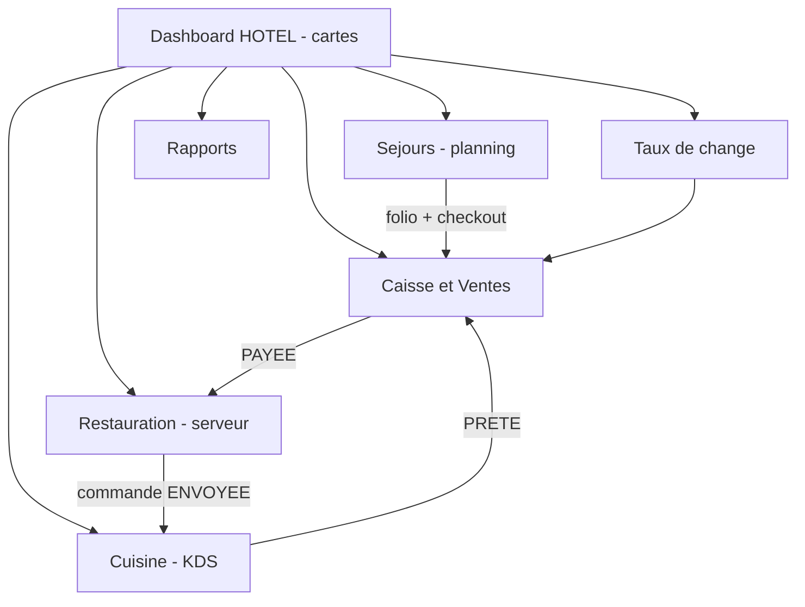
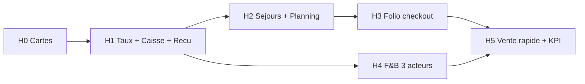

# Plan — Caisse & Ventes · Séjours · Restauration (branche HOTEL)

**Produit :** Coccinelle  
**Date :** 7 août 2026  
**Statut :** Implémenté H0→H5 (MVP dashboard) — smoke test sur branche HOTEL  
**Périmètre :** Branche `BranchType = HOTEL`  
**UX canonique :** **pas de sidebar** — tout part du **Dashboard** via des **cartes** (`…/branches/[branchId]`).

**Liens :**
- Dashboard dynamique : [`units-branches/PLAN-dashboard-dynamique.md`](./units-branches/PLAN-dashboard-dynamique.md)
- Structure modules : [`units-branches/STRUCTURE-modules-branche.md`](./units-branches/STRUCTURE-modules-branche.md)
- Plan multi-branches : [`plan-multi-branches.md`](./plan-multi-branches.md)
- Units cash / hôtel existantes : B08, B09, B10

---

## 1. Vision (reformulation de tes idées)

Tu veux qu’un **hôtel** sous Coccinelle permette :

1. **Caisse & Ventes** — encaisser (séjour, checkout, boissons / produits) avec **taux de change** configuré, puis **imprimer un reçu**.
2. **Séjours** — voir l’état de chaque chambre, réserver / attribuer, visualiser **entrée / sortie** sur un **calendrier annuel** (12 mois + changement d’année) ; le **jour de check-out en rouge**.
3. **Restauration** — flux **3 acteurs** : serveur → cuisine → caisse → livraison au serveur, avec **notification à chaque mouvement** ; la caisse peut aussi vendre des produits (boissons…) hors commande salle.

### Améliorations proposées (recommandées)

| Idée brute | Amélioration | Pourquoi |
|------------|--------------|----------|
| Paiement isolé | **Folio client** (facture séjour = nuits + F&B + extras) puis paiement (partiel / solde) | Un seul compte client à la caisse ; checkout = clôture folio |
| Calendrier « 12 mois » | **Planning occupation chambres** (lignes = chambres, colonnes = jours) + sélecteur **mois / année** + vue **année** (heatmap) | Lisibilité opérationnelle réelle ; un calendrier mois seul ne montre pas assez les chevauchements |
| Check-out rouge | **Code couleur statut** : libre = vert clair, occupé = bleu, départ du jour = **rouge**, arrivée du jour = orange, sale / ménage = gris | Check-out rouge = signal réception + ménage |
| 3 scénarios F&B | Machine d’états explicite + **écrans rôles** (Serveur / Cuisine / Caisse) ouverts depuis des **cartes distinctes** | Évite qu’un seul écran mélange tout ; notifications ciblées |
| Notifications | Canal **in-app** (cloche dashboard + toast + son optionnel cuisine/caisse) ; V1.1 : push / WhatsApp | Fiable offline-ish en LAN ; pas de dépendance externe au MVP |
| Taux de change | Taux **figé sur le paiement** (snapshot) + affichage CDF / devise secondaire sur le reçu | Conteste / audit : le reçu garde le taux du jour d’encaissement |
| Reçu | PDF / print thermal + **numéro unique** + QR folio | Même pattern que billets voyage |
| Caisse | **Session caisse** obligatoire avant vente (B08) | Traçabilité fond de caisse |

---

## 2. Principes UX (non négociables)

1. **Dashboard-first** — aucune sidebar métier. Navigation = cartes du hub HOTEL.
2. **Une carte = une intention** — Caisse, Séjours, Restauration (serveur), Cuisine, Taux de change, Rapports.
3. **Retour hub** toujours visible (navbar dashboard déjà en place).
4. **Deep-link** — chaque carte pointe vers une URL stable sous  
   `/admin/organizations/[orgId]/branches/[branchId]/…`
5. **Rôles** — un utilisateur peut n’avoir que certaines cartes (B04 BranchMember) ; V1 admin / owner voit tout.

### Cartes Dashboard HOTEL (cible)

| Carte | Route | Qui | Intention |
|-------|-------|-----|-----------|
| **Caisse & Ventes** | `…/caisse` | Caissier, réception | Session + encaisser folio / vente directe + imprimer reçu |
| **Séjours** | `…/hotel/sejours` | Réception | Planning, réservation, check-in / check-out |
| **Chambres** | `…/hotel/chambres` | Réception | Inventaire types / statuts ménage |
| **Restauration** | `…/hotel/restauration` | Serveur | Prendre / suivre commandes salle ou chambre |
| **Cuisine** *(nouvelle)* | `…/hotel/cuisine` | Cuisine | File de préparation + marquer « Prêt » |
| **Taux de Change** | `…/taux-change` | Manager / caissier | Config devises pour la branche |
| **Tableau de Bord** | `…/rapports/tableau-bord` | Owner | Occupancy, CA, tickets F&B |
| Rapports ventes / financier | `…/rapports/…` | Owner | Analyse |

> **Cuisine** = carte dédiée (pas un onglet caché dans Restauration) pour que le cuisinier n’ouvre que sa file.



---

## 3. Domaine métier

### 3.1 Folio & Paiement (cœur « Caisse & Ventes »)

```text
HotelStay (séjour)
  └── Folio (compte client)
        ├── FolioLine (nuitée, F&B, minibar, taxe…)
        └── Payment[] (cash / MM / carte)  ← liés CashSession
```

**Cas d’usage caisse**

| Cas | Déclencheur | Action | Reçu |
|-----|-------------|--------|------|
| Acompte séjour | Réservation / check-in | Paiement partiel sur folio | Oui |
| Vente produit directe | Caisse → « Vente rapide » | Ligne folio ad-hoc ou ticket POS hôtel | Oui |
| Commande F&B prête | Cuisine → statut PRETE | Encaisser ticket → marque PAYEE | Oui |
| **Check-out** | Séjours → chambre « départ » | Solde folio → paiement → libère chambre | Oui (reçu final) |

**Règles**

- Pas de paiement sans **CashSession OPEN** (sauf override manager — V1.1).
- Montants affichés en **CDF** + conversion optionnelle via **taux actif**.
- Sur le reçu : montant CDF, devise secondaire, **taux snapshot**, mode paiement, n° reçu, branche, caissier.
- Impression : `window.print` / PDF serveur (même approche que billets).

### 3.2 Séjours & calendrier chambres

**Entités**

| Entité | Rôle |
|--------|------|
| `HotelRoomType` / `HotelRoom` | Déjà en schéma (bootstrap HOTEL) |
| `HotelStay` | Client, chambre, `checkInDate`, `checkOutDate`, statut |
| `HotelStayStatus` | `RESERVED` \| `CHECKED_IN` \| `CHECKED_OUT` \| `CANCELLED` \| `NO_SHOW` |

**Statuts chambre (affichage planning)**

| Couleur | Signification |
|---------|----------------|
| Vert clair | Libre sur la période |
| Bleu | Occupé / séjour en cours |
| Orange | Arrivée prévue **aujourd’hui** |
| **Rouge** | **Départ / check-out prévu aujourd’hui** (ou overdue) |
| Gris | Hors service / ménage |

**UI Séjours (2 vues, même page)**

1. **Planning** (principale)  
   - Axe Y = chambres ; axe X = jours du mois sélectionné.  
   - Barres = séjours (entrée → sortie).  
   - Sélecteur **mois** + **année** (changer d’année = recharger 12 mois de données).  
   - Vue secondaire **Année** : 12 mini-mois ou heatmap occupation % — pour « voir l’année ».  
2. **Liste du jour** — arrivées / départs / en maison (actions check-in, check-out, ouvrir folio).

**Actions**

- Cliquer case libre → **Nouvelle réservation** (client, type/chambre, dates).  
- Cliquer barre séjour → détail + check-in / check-out / ouvrir caisse (folio).  
- Check-out **bloqué** si folio solde > 0 → CTA « Aller à la caisse ».

### 3.3 Restauration — 3 scénarios + notifications

**Machine d’états commande (`HotelOrder`)**

```text
BROUILLON → ENVOYEE → EN_PREPARATION → PRETE → EN_CAISSE → PAYEE → LIVREE
                ↘ ANNULEE (règles : avant PRETE ou avec droit manager)
```

| Étape | Acteur | Écran (carte) | Notification destinataires |
|-------|--------|---------------|----------------------------|
| 1. Lance la commande | Serveur | Restauration | Cuisine : « Nouvelle commande #… » |
| 2. Prépare | Cuisine | Cuisine | Serveur : « En préparation » |
| 3. Marque prêt | Cuisine | Cuisine | **Caisse** + Serveur : « Prêt à encaisser » |
| 4. Paiement | Caissier | Caisse & Ventes | Serveur : « Payée — à livrer » |
| 5. Livre | Serveur | Restauration | (optionnel) Cuisine : clôturée |

**Scénario parallèle — vente caisse sans serveur**

- Carte **Caisse & Ventes** → « Vente rapide » (boissons, snacks du catalogue branche / shop hôtel).  
- Même `Payment` + reçu ; pas de passage cuisine si article `needsKitchen = false`.

**Notifications V1**

- Table `BranchNotification` (ou events + polling 3–5 s / SSE).  
- Cloche dans **DashboardNavbar** (badge).  
- Toast + bip optionnel sur écrans Cuisine / Caisse.

---

## 4. Taux de change

- Config par **branche** (carte Taux de Change) : paire ex. USD→CDF, date d’effet.  
- À chaque `Payment` : stocker `exchangeRateUsed`, `amountCdf`, `amountForeign?`.  
- Reçu et rapports utilisent le snapshot, jamais le taux « live » après coup.

---

## 5. Modèle données (cible Prisma — résumé)

À ajouter progressivement (ne pas tout livrer d’un coup) :

```text
CashSession, Payment, PaymentMethod          (B08–B09 — core)
ExchangeRate (branchId, pair, rate, validFrom)

HotelStay, Folio, FolioLine
HotelOrder, HotelOrderItem, HotelMenuItem (ou réutiliser ShopProduct branch HOTEL)
BranchNotification
```

Réutiliser si possible `ShopProduct` / catégories pour le catalogue F&B + vente rapide caisse (évite double catalogue).

---

## 6. Phases d’exécution

Chaque phase = livrable **visible depuis une carte Dashboard**. Ordre strict.

### Phase H0 — Socle navigation (déjà amorcé)

| Unit | Livrable | Status |
|------|----------|--------|
| H0.1 | Cartes HOTEL + routes placeholder `caisse`, `sejours`, `restauration`, `chambres` | `done` (squelette) |
| H0.2 | Carte **Cuisine** + routes `hotelRoutes.cuisine` | `todo` |
| H0.3 | Hub **Caisse** : session placeholder + CTA Séjours / Vente rapide / File F&B | `partial` |

---

### Phase H1 — Taux de change + session caisse

| Unit | Carte entrée | Livrable testable |
|------|--------------|-------------------|
| **H1.1** | Taux de Change | CRUD taux branche ; taux actif du jour |
| **H1.2** | Caisse & Ventes | Ouvrir / clôturer `CashSession` (B08) |
| **H1.3** | Caisse & Ventes | Paiement unifié `Payment` + snapshot taux (B09 allégé) |
| **H1.4** | Caisse & Ventes | **Impression reçu** (HTML print / PDF) n° unique |

**Critère :** depuis Dashboard → Caisse → ouvrir session → encaisser un montant test → imprimer reçu avec taux.

---

### Phase H2 — Séjours + planning calendrier

| Unit | Carte entrée | Livrable testable |
|------|--------------|-------------------|
| **H2.1** | Chambres | Liste types / chambres + statut ménage |
| **H2.2** | Séjours | Modèle `HotelStay` + création réservation (dates entrée/sortie) |
| **H2.3** | Séjours | **Planning mensuel** chambres × jours + sélecteur mois/**année** |
| **H2.4** | Séjours | Couleurs : libre / occupé / arrivée / **checkout rouge** |
| **H2.5** | Séjours | Check-in ; check-out si folio à 0 sinon redirect Caisse |
| **H2.6** | Séjours | Vue **année** (12 mois occupancy) — bonus après H2.4 |

**Critère :** réserver une chambre sur le planning, voir la barre dates, jour de sortie en rouge, changer d’année.

---

### Phase H3 — Folio séjour ↔ Caisse

| Unit | Carte entrée | Livrable testable |
|------|--------------|-------------------|
| **H3.1** | Séjours / Caisse | Folio auto à la réservation / check-in (lignes nuitées) |
| **H3.2** | Caisse & Ventes | File « À encaisser » : folios avec solde + check-outs du jour |
| **H3.3** | Caisse & Ventes | Paiement acompte / solde + reçu ; libération chambre après checkout payé |

**Critère :** client checkout → solde à la caisse → paiement → reçu → chambre libre sur planning.

---

### Phase H4 — Restauration (3 acteurs)

| Unit | Carte entrée | Livrable testable |
|------|--------------|-------------------|
| **H4.1** | Restauration | Catalogue items F&B (`needsKitchen`) |
| **H4.2** | Restauration | Serveur crée commande (table / chambre) → ENVOYEE |
| **H4.3** | Cuisine | KDS : file ENVOYEE / EN_PREPARATION → PRETE |
| **H4.4** | Caisse & Ventes | File PRETE → paiement → PAYEE + reçu |
| **H4.5** | Restauration | Serveur voit PAYEE → marque LIVREE |
| **H4.6** | (Navbar) | Notifications à chaque transition d’état |

**Critère :** parcours complet serveur → cuisine → caisse → serveur avec notifs visibles.

---

### Phase H5 — Vente rapide caisse + polish

| Unit | Carte entrée | Livrable testable |
|------|--------------|-------------------|
| **H5.1** | Caisse & Ventes | Vente produits / boissons sans cuisine |
| **H5.2** | Caisse & Ventes | Panier multi-lignes + modes paiement (cash / MM / carte) |
| **H5.3** | Tableau de Bord | KPI : occupancy, CA caisse jour, tickets F&B |
| **H5.4** | — | Permissions BranchMember (réception / serveur / cuisine / caissier) |

---

## 7. Ordre de chantier recommandé



**Ne pas** commencer par la cuisine avant H1 (la caisse doit pouvoir encaisser).  
**Ne pas** faire le checkout complet avant H2 (besoin des séjours).

---

## 8. Hors scope V1 (noter pour ne pas dériver)

- Channel manager OTA / Booking.com  
- App mobile native serveur  
- Imprimante cuisine ESC/POS réseau (V1.1 : print browser suffit)  
- Pourboires / split bill avancé (V1.1)  
- Multi-devises > 2  

---

## 9. Critères d’acceptation globaux (demo owner)

1. Depuis **Dashboard HOTEL**, uniquement des **cartes** (pas de sidebar).  
2. **Séjours** : planning mois + année ; checkout du jour en **rouge** ; réservation visuelle.  
3. **Caisse** : payer séjour / checkout / produit ; **reçu imprimable** avec taux.  
4. **Restauration** : 3 rôles enchaînés avec **notifications**.  
5. **Taux de change** configuré impacte l’affichage et le reçu.

---

## 10. Prochaine action concrète

**Implémentation H0→H5 livrée** (schéma + écrans dashboard) — valider en smoke sur une branche HOTEL.

1. Ouvrir Dashboard HOTEL → Caisse (session) → Taux → Séjours (planning) → Restauration → Cuisine → Caisse (encaisser) → Reçu.
2. Ajuster UX / permissions BranchMember ensuite (H5.4).
