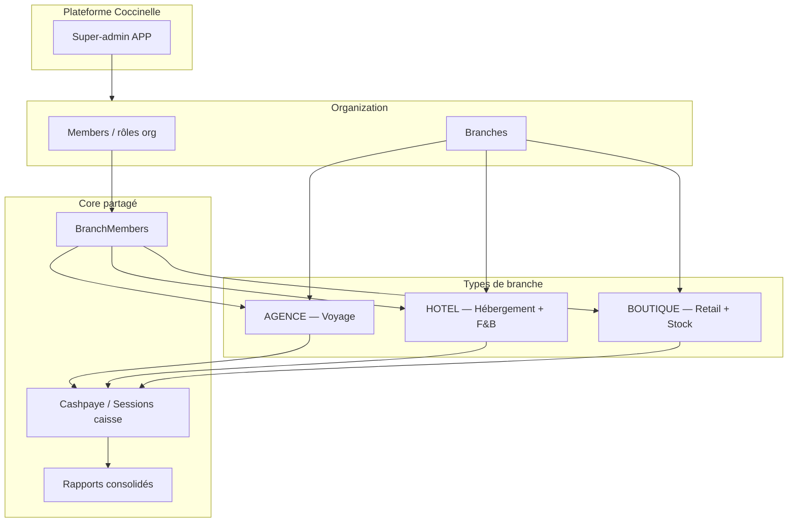

# Plan — Multi-branches Coccinelle (Organization · Member · Branch · BranchMember)

**Produit :** Coccinelle  
**Date :** 5 août 2026  
**Statut :** En cours — units B01–B03 + B05 livrés ; suite B04 → B06… (voir [`units-branches/INDEX.md`](./units-branches/INDEX.md))  
**Objectif :** Faire évoluer Coccinelle d’une org « mono-agence voyage » vers une **organisation multi-branches multi-métiers**, avec trois types de points d’exploitation (Agence voyage, Hôtel, Boutique), une équipe assignable par branche, et un encaissement (cash / mobile money / carte) cohérent partout.

**Liens :**
- Plan voyage déjà livré : [`plan-restructuration-reservation.md`](./plan-restructuration-reservation.md)
- Units voyage : [`units/INDEX.md`](./units/INDEX.md)
- Schéma actuel : `prisma/schema.prisma` (`Organization`, `Member` Better Auth — **pas encore** de `Branch`)
- Permissions : `lib/permissions.ts` (Better Auth access control)

---

## 1. Contexte et problème

### État actuel

| Concept | Situation Coccinelle |
|---------|----------------------|
| **Organization** | Entité Better Auth (`organization`) = tenant ; slug PWA ; contient trajets / réservations |
| **Member** | Membre d’org (`member`) + rôles `owner` / `gestionnaire` / `guichetier` / `parent` |
| **« Agence »** | Aujourd’hui **confondue avec l’org** (`/admin/organizations/[id]/agences/…`, `/agence/[orgId]/gerant`) — un seul point d’exploitation implicite |
| **Branche** | **Absente** du modèle |
| **BranchMember** | **Absent** — l’affectation se limite au rôle org, sans lieu / métier |
| **Métiers** | Uniquement **voyage** (bus/avion) ; hôtel & boutique non modélisés |
| **Cashpaye** | Paiement réservation (`CASH` / `MOBILE_MONEY` / `CARTE`) lié au voyage seulement |

### Problème produit

Le client métier (owner) veut une **même société** qui exploite plusieurs **points de vente / d’accueil**, éventuellement de natures différentes :

1. **Agence** — vente de billets, réservations voyage, colis, encaissement  
2. **Hôtel** — réservation de chambres, commandes restauration, encaissement  
3. **Boutique** — vente produits, stock, encaissement  

Sans notion de **branche**, on ne peut ni isoler la caisse, ni les stocks, ni les équipes d’un site, ni ouvrir un 2ᵉ guichet ou un hôtel sous la même org.

### Objectif produit

> Une **Organization** = entreprise / marque.  
> Une **Branch** = site d’exploitation typé (Agence | Hôtel | Boutique).  
> Un **Member** = appartenance à l’org.  
> Un **BranchMember** = rattachement d’un member à une branche + rôle opérationnel local.  
> Un **module cashpaye** partagé pour toutes les ventes comptoir / POS.

---

## 2. Vision et principes

### 2.1 Vocabulaire canonique (FR + technique)

| Terme métier (UI) | Terme technique | Définition |
|-------------------|-----------------|------------|
| Organisation / Société | `Organization` | Tenant Better Auth ; facturation, marque, slug public |
| Membre | `Member` | Lien User ↔ Organization (+ rôle org) |
| Branche / Point d’exploitation | `Branch` | Site physique ou logique rattaché à une org |
| Type de branche | `BranchType` | `AGENCE` \| `HOTEL` \| `BOUTIQUE` |
| Affectation | `BranchMember` | Member affecté à une Branch + rôle branche |
| Cashpaye / Encaissement | `Payment` / `CashSession` (cible) | Encaissement unifié (cash, MM, carte) |
| Guichet / Caisse | UI canal | Point de vente d’une branche |

> **Business label** (libellé commercial) : texte affiché selon le type (`Agence`, `Hôtel`, `Boutique`) — distinct du slug technique `BranchType`.

### 2.2 Principes d’architecture

1. **Org = tenant ; Branch = scope opérationnel** — Données métier (caisse, stock, chambres, départs) sont **scopées branche** dès que pertinent ; l’org conserve supervision et paramétrage global.
2. **Un core, trois verticales** — Identité, membres, branches, paiements, rapports consolidés = **core**. Voyage / Hôtel / Boutique = **modules** activés par `BranchType`.
3. **Better Auth reste la source d’authZ org** — `Member.role` + `hasPermission` pour le niveau organisation. Le niveau branche s’ajoute via `BranchMember` + permissions ressource `branch:*` / modules (sans inventer un 2ᵉ système d’auth).
4. **Migration douce** — L’existant voyage devient la branche **AGENCE** par défaut de chaque org (backfill), sans casser les routes immédiatement.
5. **Cashpaye partout** — Même modèle de paiement / caisse pour billetterie, chambre, resto, boutique.
6. **Une décision UX par écran** — Après login : choisir **organisation** (si multi) puis **branche active** (si multi), puis shell métier du type.



---

## 3. Modèle de domaine cible

### 3.1 Entités cœur

#### Organization (existant, enrichi)

| Champ / idea | Rôle |
|--------------|------|
| `id`, `name`, `slug`, `logo` | Identité (Better Auth) |
| `metadata` / champs dédiés | Devise par défaut (CDF), timezone, politiques |
| Relations | `members`, `branches`, invitations, roles dynamiques |

#### Member (existant)

| Champ | Rôle |
|-------|------|
| `organizationId`, `userId`, `role` | Appartenance + **rôle organisationnel** (stratégique) |
| Rôles org proposés (évolution) | `owner`, `org_admin` (ex-gestionnaire transverse), `member`, éventuellement `auditor` |

> Les rôles **opérationnels** (guichetier, réceptionniste, caissier boutique…) vivent surtout au niveau **BranchMember**, pas seulement au niveau org.

#### Branch (nouveau)

| Champ | Type | Description |
|-------|------|-------------|
| `id` | uuid | PK |
| `organizationId` | FK | Org parente |
| `type` | enum `BranchType` | `AGENCE` \| `HOTEL` \| `BOUTIQUE` |
| `name` | string | Ex. « Agence Gombe », « Hôtel Fleuve », « Boutique Victoire » |
| `code` | string | Code court unique **par org** (ex. `AG-GOMBE`) |
| `slug` | string? | Optionnel pour URL publique locale |
| `status` | enum | `ACTIVE` \| `SUSPENDED` \| `CLOSED` |
| `address`, `city`, `phone` | | Coordonnées site |
| `timezone` | string | Défaut org |
| `settings` | Json | Paramètres module (horaires, devise override, etc.) |
| `createdAt` / `updatedAt` | | Audit |

Contraintes :
- `@@unique([organizationId, code])`
- Index `(organizationId, type)`, `(organizationId, status)`

#### BranchMember (nouveau)

| Champ | Type | Description |
|-------|------|-------------|
| `id` | uuid | PK |
| `branchId` | FK | Branche |
| `memberId` | FK | Member org (pas User nu — garantit l’appartenance org) |
| `role` | string | Rôle **branche** (voir §4) |
| `isPrimary` | boolean | Branche par défaut de ce member |
| `status` | enum | `ACTIVE` \| `REVOKED` |
| `createdAt` / `updatedAt` | | |

Contraintes :
- `@@unique([branchId, memberId])`
- Un member ne peut être affecté qu’à des branches de **son** org (contrôle applicatif + éventuellement trigger)

#### Session / contexte actif (cible)

Étendre le contexte session (custom session Better Auth ou cookie app) :

- `activeOrganizationId` (déjà Better Auth)
- `activeBranchId` (nouveau) — obligatoire dès qu’il y a ≥ 1 branche pour les écrans métier

### 3.2 Relation avec les données voyage existantes

Aujourd’hui `Trajet.organizationId`, `Reservation`, etc. sont **org-scoped**.

**Cible :**

| Entité | Scope cible | Migration |
|--------|-------------|-----------|
| `Trajet`, `TrajetDepart`, `Reservation`, `Colis`, drafts | `branchId` (+ garder `organizationId` dénormalisé pour perf / isolation) | Backfill : créer branche AGENCE « Principale » par org ; rattacher toutes les lignes |
| Rapports gérant | Filtre branche ou consolidation org | Phase rapports |
| PWA `/[orgSlug]` | Org publique ; choix de branche AGENCE si plusieurs | Phase PWA |

Principe : **ne jamais orpheliner** une réservation — toujours `organizationId` + `branchId`.

### 3.3 Schéma conceptuel

```text
Organization 1──* Member *──1 User
Organization 1──* Branch
Branch       1──* BranchMember *──1 Member
Branch.type ∈ { AGENCE, HOTEL, BOUTIQUE }

Branch(AGENCE) 1──* Trajet / Départs / Réservations voyage / Colis
Branch(HOTEL)  1──* RoomType / Room / Stay / Folio / F&B Order
Branch(BOUTIQUE) 1──* Category / Product / StockMove / Sale
Branch         1──* CashSession / Payment (core cashpaye)
```

---

## 4. Trois types de branche (business labels)

### 4.1 AGENCE — « Agence » (voyage)

**Intention :** Point de vente / opération transport (équivalent actuel Coccinelle voyage).

| Capacité | Description | Cashpaye |
|----------|-------------|----------|
| Recherche / vente billets | Funnel déjà livré (U05–U15) | Oui (guichet + en ligne) |
| Colis | Suivi statuts (U17) | Oui (lié ou colis seul) |
| Embarquement QR | U16 | — |
| Planning / trajets | Espace gérant | — |
| Caisse du jour | Sessions caisse + modes paiement | **Oui** |

**Rôles branche typiques :** `branch_manager`, `ticket_agent` (guichetier), `boarding_agent`, `readonly`.

**UI shells :** réutiliser `/agence/…/gerant` et guichet en les **rebaptissant** « branche AGENCE » + sélecteur de branche.

### 4.2 HOTEL — « Hôtel »

**Intention :** Établissement d’hébergement + restauration associée.

| Module | Contenu V1 | Cashpaye |
|--------|------------|----------|
| **Hébergement** | Types de chambres, inventaire, calendrier dispo, réservation séjour, check-in / check-out | Oui (acompte / solde) |
| **Restauration (F&B)** | Carte / menus, commande salle ou chambre, statut préparation | Oui (addition) |
| **Folio client** | Facture séjour = nuits + extras F&B + taxes | Encaissement folio |
| **Réception** | Arrivées du jour, chambres sales/libres (statuts simples V1) | — |

**Hors scope V1 hôtel :** channel manager OTA, yield avancé, spa, multi-devises complexes.

**Rôles branche typiques :** `branch_manager`, `receptionist`, `housekeeping` (lecture/statuts), `fnb_cashier`, `readonly`.

### 4.3 BOUTIQUE — « Boutique »

**Intention :** Commerce de détail + stock.

| Module | Contenu V1 | Cashpaye |
|--------|------------|----------|
| **Catalogue** | Catégories, produits, prix CDF, variantes simples (taille/couleur optionnel V1.1) | — |
| **Stock** | Quantité par branche, mouvements (entrée, sortie, ajustement, transfert inter-branches V1.1) | — |
| **POS / Caisse** | Panier, ticket de caisse, remises bornées | **Oui** |
| **Inventaire** | Comptage + écarts | — |

**Hors scope V1 boutique :** e-commerce public complet, supply-chain multi-entrepôts lourde, fidélité avancée.

**Rôles branche typiques :** `branch_manager`, `cashier`, `stock_clerk`, `readonly`.

### 4.4 Matrice « ce que la branche active débloque »

| Capacité UI | AGENCE | HOTEL | BOUTIQUE |
|-------------|:------:|:-----:|:--------:|
| Sélecteur branche | ✓ | ✓ | ✓ |
| Dashboard type-spécifique | Voyage KPI | Occ. + F&B | CA + stock bas |
| Cashpaye / session caisse | ✓ | ✓ | ✓ |
| Module voyage | ✓ | | |
| Module hôtel | | ✓ | |
| Module boutique | | | ✓ |
| Rapports consolidés org | via owner / org_admin | idem | idem |

---

## 5. Membres, rôles et permissions

### 5.1 Deux niveaux de rôle (obligatoire à documenter)

| Niveau | Où | Exemples | Décide |
|--------|-----|----------|--------|
| **Organisation** | `Member.role` | `owner`, `org_admin`, `member` | Créer branches, inviter users, voir consolidation, policies |
| **Branche** | `BranchMember.role` | `branch_manager`, `ticket_agent`, `receptionist`, `cashier`… | Opérer le site (vente, stock, chambres) |

Règles :

1. Pas de `BranchMember` sans `Member` actif dans la même org.  
2. `owner` org peut tout sur toutes les branches (bypass ou grants implicites) — via permissions Better Auth + checks branche.  
3. Un user peut être `BranchMember` de **plusieurs** branches (multi-sites).  
4. `activeBranchId` doit appartenir aux branches où le user a un `BranchMember` ACTIVE (sauf owner).

### 5.2 Mapping depuis l’existant

| Ancien rôle org | Devenir |
|-----------------|---------|
| `owner` | Reste `owner` org |
| `gestionnaire` | `org_admin` **ou** `branch_manager` sur la branche AGENCE (décision §11) |
| `guichetier` | `BranchMember.role = ticket_agent` sur AGENCE |
| `parent` | Client ; **pas** de BranchMember staff (reste self-service org / PWA) |

### 5.3 Resources Better Auth à ajouter (indicatif)

Étendre `accessControlStatements` (toujours via Better Auth, pas de RBAC parallèle) :

```text
branch:        create | update | delete | read | assign
cash:          open | close | take | read
hotel_stay:    create | update | checkin | checkout | read
hotel_fnb:     create | update | read
catalog:       create | update | delete | read
stock:         adjust | transfer | read
pos:           sell | refund | read
```

Les resources voyage actuelles (`inscription`, `trajet`, `depart`, `embarquement`, `rapport`, `equipe`) restent, mais les gates serveur vérifient aussi **`activeBranchId` + type AGENCE**.

### 5.4 Directive d’implémentation auth

1. MCP / docs Better Auth avant toute nouvelle permission.  
2. Déclarer statements → roles → `hasPermission`.  
3. Helper cible : `assertBranchPermission(organizationId, branchId, permissions)`.  
4. Interdit : `if (role === "guichetier")` comme seule autorité.  
5. Logs d’audit recommandés sur assignation `BranchMember` et ouvertures de caisse.

---

## 6. Cashpaye (encaissement unifié)

« Cashpaye / cashapie » = capacité d’**encaisser** sur le point d’exploitation, quel que soit le module.

### 6.1 Concepts

| Concept | Description |
|---------|-------------|
| **CashSession** | Ouverture / fermeture de caisse par branche + agent (`BranchMember`) |
| **Payment** | Ligne d’encaissement liée à un document métier (réservation voyage, séjour, commande F&B, vente POS) |
| **Méthodes** | Réutiliser `MethodePaiement` : `CASH`, `MOBILE_MONEY`, `CARTE` |
| **Statuts** | Réutiliser `StatutPaiement` : `EN_ATTENTE`, `PAYE`, `ECHOUE` |

### 6.2 Document métier polymorphique (cible)

Éviter 4 tables paiement isolées sans lien :

- Option A (recommandée V1) : `Payment` avec `sourceType` + `sourceId` (`RESERVATION` \| `STAY` \| `FNB_ORDER` \| `POS_SALE`) + `branchId`  
- Option B : garder `Paiement` voyage et généraliser plus tard (dette)

**Directive :** dès la phase branches, introduire un **Payment core** branch-scoped ; migrer l’existant `Paiement` voyage vers ce modèle ou le dual-write temporairement.

### 6.3 Règles caisse

1. Vente comptoir exige une **CashSession OPEN** (sauf config « caisse libre » org).  
2. Clôture de caisse = total attendu vs déclaré (écart tracé).  
3. Remises : plafonds par rôle branche.  
4. Annulation / remboursement : permission `pos:refund` / équivalent + motif.

---

## 7. Interfaces et navigation cible

### 7.1 Parcours post-login (évolution de `post-login-redirect.ts`)

```text
1. Authentifié ?
2. APP admin → /admin
3. Choisir / activer Organization
4. Si staff :
     - Si 0 branche → onboarding « Créer première branche »
     - Si 1 branche → activeBranchId auto
     - Si N branches → /select-branch
5. Selon BranchType + BranchMember.role → shell module
6. Si parent (client) → PWA org (voyage) ; plus tard portails hôtel/boutique si besoin
```

### 7.2 Shells UI

| Espace | Route cible (proposition) | Contenu |
|--------|---------------------------|---------|
| Admin plateforme | `/admin` | Orgs, suspension, support (U18) |
| Org hub | `/org/[orgId]` | Branches, membres org, consolidation |
| Sélecteur branche | `/org/[orgId]/branches/select` | Cartes par type |
| Branche AGENCE | `/branch/[branchId]/travel/…` | Portage depuis `/agence/…` |
| Branche HOTEL | `/branch/[branchId]/hotel/…` | Réception, chambres, F&B |
| Branche BOUTIQUE | `/branch/[branchId]/shop/…` | POS, stock, catalogue |
| PWA client | `/[orgSlug]/…` | Voyage d’abord ; extensions ultérieures |

> Les chemins `/agence/[orgId]/gerant` restent valides pendant une **période de compat** (redirect → branche AGENCE principale).

### 7.3 Navigation org hub

```text
Organisation
├── Vue d’ensemble (KPI multi-branches)
├── Branches (CRUD + type + statut)
├── Membres org (invitations Better Auth)
├── Affectations (BranchMembers)
├── Paramètres (devise, timezone, cashpaye)
└── Rapports consolidés
```

---

## 8. Migration depuis l’existant (critique)

### Phase M0 — Préparation

1. Inventaire : toutes les tables avec `organizationId` métier voyage.  
2. Décision dual-write vs big-bang `branchId`.  
3. Seeds : 1 org → 1 branche `AGENCE` « Principale ».

### Phase M1 — Introduire Branch + BranchMember

1. Migrations Prisma `Branch`, `BranchMember`, enum `BranchType`.  
2. Backfill automatique à la migration ou script seed.  
3. `activeBranchId` dans custom session.  
4. UI minimale : liste branches + affectation members.

### Phase M2 — Scoper le voyage

1. Ajouter `branchId` NOT NULL (après backfill) sur trajets / réservations / colis / départs.  
2. Gates `assertBranchPermission` sur guichet / gérant.  
3. Redirects legacy → branche AGENCE.

### Phase M3 — Cashpaye core

1. `CashSession` + `Payment` unifié.  
2. Brancher le guichet voyage sur ce core.

### Phase M4 — Module HOTEL (MVP)

1. Modèles chambre / séjour / commande F&B.  
2. Shell réception + cashpaye.

### Phase M5 — Module BOUTIQUE (MVP)

1. Produits / stock / POS.  
2. Shell caisse + mouvements stock.

### Phase M6 — Polish multi-branches

1. Transferts stock inter-branches (optionnel).  
2. Rapports consolidés org.  
3. Suppression dettes routes `/agences` ambiguës.

---

## 9. Architecture technique

```mermaid
flowchart TB
  subgraph ui [Interfaces]
    AdminUI[Admin plateforme]
    OrgUI[Org hub]
    TravelUI[Shell AGENCE]
    HotelUI[Shell HOTEL]
    ShopUI[Shell BOUTIQUE]
    PWA[PWA client]
  end

  subgraph app [Application]
    Actions[Server Actions]
    BranchCtx[activeOrganization + activeBranch]
    AuthZ[Better Auth hasPermission + assertBranchPermission]
    Modules[Modules travel | hotel | shop]
    CashCore[Cashpaye core]
  end

  subgraph data [Données]
    Prisma[Prisma 7]
    PG[(PostgreSQL)]
  end

  ui --> Actions
  Actions --> BranchCtx --> AuthZ
  Actions --> Modules
  Actions --> CashCore
  Modules --> Prisma
  CashCore --> Prisma
  Prisma --> PG
```

### Directives techniques (obligatoires à l’exécution)

1. **Prisma** : migrations nommées ; pas de reset prod ; backfill scripts idempotents.  
2. **Better Auth** : toute nouvelle permission documentée ; pas de matrice parallèle.  
3. **Multi-tenant** : chaque query métier filtre `organizationId` **et** `branchId` quand scopé.  
4. **UI** : tokens thème Coccinelle (noir/orange) ; shells distincts par `BranchType` (navigation, pas seulement un badge).  
5. **Tests** : unit permissions branche ; test concurrence stock ; test caisse open/close.  
6. **Observabilité** : journal minimal assignations + clôtures caisse.  
7. **Feature flags** : activer HOTEL / BOUTIQUE par org (`Organization.settings.enabledModules`) pour rollout progressif.

---

## 10. Phasage de livraison & units (esquisse)

**À la validation de ce plan, exécuter les units dans** [`units-branches/INDEX.md`](./units-branches/INDEX.md) (B01 → B12).

| Phase | Units | Résultat visible |
|-------|-------|------------------|
| **B0 Fondations** | B01–B06 | Branch + bootstrap + org→branches + purge admin |
| **B1 Voyage scopé** | B07 | Domaine voyage branch-scoped |
| **B2 Cashpaye** | B08–B09 | Caisse + payment unifié |
| **B3–B5 Modules** | B10–B12 | Hôtel, Boutique, rapports |

**Estimation indicative :** 10–16 semaines selon profondeur hôtel/boutique et décisions paiement MM.

---

## 11. Décisions à trancher avant / pendant le build

1. **Better Auth Teams vs modèle `Branch` custom** — Teams peut inspirer, mais les types métier + cashpaye plaident pour **`Branch` first-class** (recommandé).  
2. **`gestionnaire` legacy** — Devient `org_admin` transverse, ou uniquement `branch_manager` AGENCE ?  
3. **Une org = multi-types** — Confirmé (oui) : même org peut avoir Agence + Hôtel + Boutique.  
4. **PWA client multi-métiers** — V1 : voyage seulement ; hôtel/boutique staff-first ?  
5. **Inventaire boutique** — Stock négatif interdit (recommandé) vs toléré avec alerte.  
6. **Chambres hôtel** — Attribution chambre à la réservation vs à l’arrivée (check-in).  
7. **Devise** — CDF only V1 (aligné voyage) ou multi-devises par branche.  
8. **Transfert stock inter-branches** — V1.1 ou V1.  
9. **Nom UI** — garder « Branche » ou dire « Site » / « Point de vente » selon persona.  
10. **CashSession obligatoire** — dès V1 cashpaye ou option org.

---

## 12. Critères de succès

| Critère | Mesure |
|---------|--------|
| Multi-sites | Une org avec ≥ 2 branches AGENCE isolées (données / caisse) |
| Multi-métiers | Une org avec 1 AGENCE + 1 HOTEL + 1 BOUTIQUE opérationnelles |
| Sécurité | Staff boutique ne voit pas les réservations voyage d’une autre branche |
| AuthZ | Aucun gate critique basé uniquement sur `if (role === …)` |
| Migration | Orgs existantes continuent de vendre des billets après backfill AGENCE |
| Cashpaye | Clôture de caisse possible sur les 3 types |
| UX | Choix de branche &lt; 2 clics après login staff |

---

## 13. Risques et mitigations

| Risque | Mitigation |
|--------|------------|
| Big-bang `branchId` casse la prod voyage | Backfill + dual-read ; feature flag ; période redirect |
| Explosion de rôles | Catalogue fermé de rôles branche par `BranchType` ; pas de rôles libres V1 |
| Permissions incohérentes | Une seule grille Better Auth + helper `assertBranchPermission` testé |
| Scope creep hôtel/boutique | MVP strict (§4) ; OTA / e-commerce reportés |
| Confusion « agence » UI | Glossaire §2.1 + renommage progressif des menus |

---

## 14. Livrables de ce plan

| Livrable | Description |
|----------|-------------|
| **Ce document** | Référence produit + technique multi-branches |
| **Units `Bxx`** (suivant) | Découpage exécutable comme `units/INDEX.md` |
| **ADR courts** (recommandé) | Décisions §11 figées (Teams vs Branch, Payment unifié, etc.) |
| **Alignement** | Mettre à jour `doc/vision.md` / `doc/plan.md` quand le plan est validé |

---

## 15. Prochaines actions immédiates

1. **Valider** ce plan avec le métier (surtout multi-types sous une org + cashpaye).  
2. **Trancher** §11 points 1, 2, 4, 10.  
3. Créer le dossier `context/units-branches/` + `INDEX.md` (B01…).  
4. Démarrer **B01** (schéma `Branch` + UI liste) sans encore casser le voyage.  
5. Prévoir script de **backfill AGENCE Principale** avant tout `branchId` NOT NULL.

---

## 16. Directives pour l’agent d’exécution (à coller dans l’INDEX branches)

Lors de l’implémentation d’une unit branches :

1. Lire la unit entière + ce plan (§ concerné).  
2. Suivre skills Prisma / Better Auth / shadcn listés.  
3. Consulter MCPs (`user-Prisma`, `user-better-auth`, shadcn) **avant** d’inventer une API permissions.  
4. Ne pas merger Hôtel/Boutique dans le même PR que le backfill voyage.  
5. Toute query métier : prouver le filtre `organizationId` (+ `branchId` si scopé).  
6. Mettre à jour `status` unit + INDEX ; critères d’acceptation cochés un par un.  
7. Conserver la compatibilité des seeds (`owner@`, `guichetier@`, etc.) en les migrant vers BranchMembers.

---

## Références internes

- Auth org : `lib/auth.ts`, `lib/permissions.ts`, `lib/auth/organization-permission.ts`  
- Redirects : `lib/auth/post-login-redirect.ts`  
- Routes agence actuelles : `lib/agence/routes.ts`  
- Domaine voyage : `lib/reservation/`, `lib/search-departs/`  
- Schéma : `prisma/schema.prisma`
