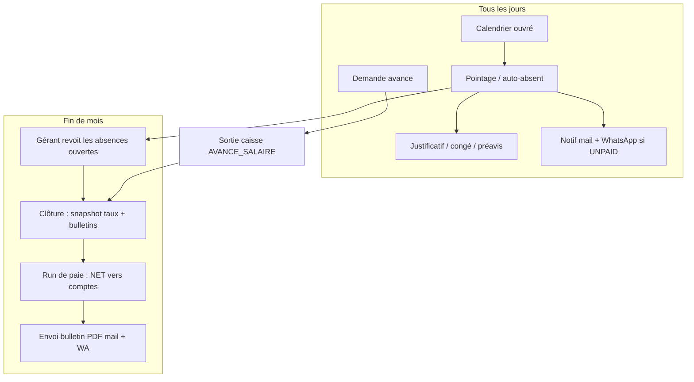

# Plan — Paie des agents commerce (journalier → versement mensuel)

| | |
|---|---|
| **Status** | `todo` — plan lisible, pas encore implémenté |
| **Périmètre V1** | Branche `BranchType = BOUTIQUE` **ou `USINE`** (famille commerce, `isCommerceBranchType`) · agents `BranchMember` ACTIVE |
| **Modèle** | Taux **journalier en USD** (défaut **10 $**) · conversion au **taux actif de la branche** · **versement une fois par mois** sur le compte de l’agent |
| **UX** | Dashboard-first (cartes hub BOUTIQUE) · même pattern que POS / Dépenses / Équipe |
| **Notifs** | Email SMTP + WhatsApp Zindua · branding `Branch.name` ([`plan-notifications-email-whatsapp.md`](./plan-notifications-email-whatsapp.md)) |
| **Liens** | Équipe R04 · Taux `ExchangeRate` · Sorties caisse `BranchExpense` + `Payment` · `User.phone` / `User.email` |

---

## 1. Besoin métier (reformulé)

Les agents d’une boutique ne sont pas payés « au mois forfaitaire » : ils **gagnent un jour travaillé**. Le gérant veut :

1. Un **prix du jour** connu (10 USD par défaut, convertible en CDF au taux de la branche).
2. Savoir **qui était là**, **qui était absent**, **qui était en congé**.
3. **Ne pas couper** le jour si l’agent a prévenu à l’avance (congé / absence prévenue) **ou** si l’absence a été **justifiée et acceptée**.
4. **Couper 10 $** seulement si l’absence n’est **pas** justifiée — et **prévenir** l’agent (mail + WhatsApp) du montant qui sera retiré.
5. Autoriser une **avance sur salaire** pendant le mois.
6. À la **fin du mois** : bulletin clair + **verser le reste** (brut − absences non payées − avances) sur le compte de l’agent.

**Idée brute vs décision (améliorations)**

| Idée brute | Décision V1 | Pourquoi (pratique paie) |
|------------|-------------|---------------------------|
| Chaque jour calendaire = 10 $ | **Jours ouvrés de la branche seulement** (ex. lun–sam). Dimanche / férié / jour non planifié = **ni gagné ni coupé** | Ne pas taxer un repos. C’est le standard « daily wage / journalier » |
| Absent = −10 $ tout de suite | **Présence et paie sont deux champs distincts.** L’absence reste enregistrée **toujours**. Le −10 $ n’est appliqué que si le **traitement paie** = non payé | Audit + bulletin honnête : on voit l’absence même si le jour est payé |
| Justification acceptée → on « oublie » l’absence | **On laisse le 10 $** mais le jour reste `ABSENT` + motif `JUSTIFIEE` | Exactement ton besoin ; jamais d’effacement d’historique |
| Mail seulement si non justifié | **Notification dès le marquage absent** (montant *à risque*) + **rappel** si toujours non justifié avant clôture | L’agent a le temps de se justifier ; pas de surprise le 31 |
| Congé = « pas absent » | Congé / préavis = **jour d’absence au planning** mais **payé**. Visible au bulletin comme « congé » ou « prévenu », **pas** comme −10 $ | Transparence sans punir |
| Avance libre | Plafond = **% des jours déjà acquis** ce mois (pas du mois entier projeté). Une avance ne peut pas dépasser le **net déjà gagné − avances déjà versées** | Évite de prêter de l’argent non encore gagné |
| Payer chaque jour | **Cumul journalier, règlement mensuel** (une run de paie) | Moins de frais Mobile Money / banque, un bulletin, un virement |
| Taux live au jour J | Taux USD→CDF **figé à la clôture** du bulletin | Le bulletin ne change plus si le taux bouge le 2 du mois suivant |
| Un seul tarif 10 $ pour tous | **Défaut branche 10 $** + **override par agent** (ancienneté, poste) | Le 10 $ reste le défaut ; le gérant peut payer 12 $ un chef de rayon |
| Verser « quelque part » | Profil de versement : **Mobile Money / Banque / Espèces** + coordonnées. Run de paie → `BranchExpense` + `Payment` | Traçable dans la caisse déjà existante |

---

## 2. Comment se fait une bonne paie « au jour » (référentiel)

Les logiciels RH (Odoo Payroll, Sage, BambooHR, et la pratique journalier en RDC / retail) font tous la même chose :

```text
1. Calendrier de travail  →  quels jours l’agent DEVRAIT être là
2. Pointage / exceptions  →  ce qui s’est passé (présent, absent, congé…)
3. Traitement paie        →  ce jour est-il PAYÉ ou NON ?
4. Période de paie        →  on additionne, on déduit les avances, on fige
5. Bulletin immuable      →  l’agent lit, le gérant valide
6. Virement / cash        →  on paie le NET, on archive
```

**Règles d’or (non négociables dans Coccinelle)**

1. **On n’efface jamais un jour.** Justifier ≠ supprimer. Le système garde `ABSENT` + `payTreatment = PAID`.
2. **On ne déduit pas en silence.** Toute coupe de 10 $ est visible sur le jour, notifiée, et reprise en ligne sur le bulletin (`− 10 $ · absence non justifiée · 12 août`).
3. **Présence ≠ paie.** Un congé n’est pas une présence. Un absent justifié n’est pas présent. Le bulletin montre les deux colonnes.
4. **Le mois se verrouille.** Après clôture, on ne « corrige » pas le bulletin : on passe un **ajustement** sur la période suivante (crédit / débit). Sinon les montants déjà versés deviennent incohérents.
5. **On paie ce qui est gagné, pas un forfait magique.**  
   `net = (jours ouvrés × taux) − (jours non payés × taux) − avances`.
6. **Devise de calcul = USD** (comme le reste de Coccinelle). Affichage CDF = `USD × ExchangeRate` **snapshot** à la clôture.
7. **Une personne, une branche, une période** → un bulletin. Un agent multi-boutiques = un bulletin **par** branche (V1).

---

## 3. Vocabulaire (à coller dans le produit)

| Terme UI | Sens |
|----------|------|
| **Jour ouvré** | Jour où l’agent est *attendu* (calendrier branche ∩ dates d’affectation) |
| **Présent** | Il a travaillé (pointage gérant, ou signal POS — voir P1) |
| **Absent** | Pas venu un jour ouvré. **Toujours** historisé |
| **Prévenu** | Signalé **avant** le cutoff (ex. veille 18 h, timezone branche) → jour **payé**, statut absent/off |
| **Congé** | Demande approuvée (dates futures) → jours **payés**, pas de notif « vous allez perdre 10 $ » |
| **Justifié** | Après coup : motif + (optionnel) preuve → gérant **accepte** → **payé**, absent conservé |
| **Non justifié** | Pas de justificatif, ou **refusé**, ou délai dépassé → **−10 $** + notif |
| **Avance** | Acompte sur le net déjà acquis ce mois |
| **Brut** | `jours ouvrés × taux journalier` |
| **Net à verser** | Brut − absences non payées − avances |
| **Bulletin** | Document figé (PDF + écran) pour la période |
| **Run de paie** | Action gérant : valider tous les bulletins du mois + marquer **versé** |

---

## 4. Règles de calcul

### 4.1 Taux

```
taux_agent_usd     = StaffPayrollProfile.dailyRateUsd
                     ?? BranchPayrollSettings.defaultDailyRateUsd   // 10
taux_cdf_par_usd   = ExchangeRate actif de la branche (snapshot à clôture)
montant_jour_cdf   = taux_agent_usd × taux_cdf_par_usd
```

Le **10 $** n’est jamais « converti chaque matin puis oublié » : on stocke le jour en **USD**. La conversion CDF n’est qu’un affichage, figé sur le bulletin.

### 4.2 Calendrier

`BranchPayrollSettings.workWeek` — défaut commerce RDC : **lundi → samedi**.

Un jour D compte comme ouvré pour l’agent A ssi :

- D est dans la `workWeek` (et pas férié branche, V1.1) ;
- A a un `BranchMember` ACTIVE ce jour-là (embauche / sortie en cours de mois = prorata) ;
- D n’est pas un jour de repos individuel (V1.1 ; V1 = calendrier branche seul).

### 4.3 Matrice présence → paie

| `attendanceKind` | Déclencheur | `payTreatment` | Bulletin | Notif −10 $ |
|------------------|-------------|----------------|----------|-------------|
| `PRESENT` | Pointé présent | `PAID` | Présent | Non |
| `REST` | Jour non ouvré | `NONE` | — (hors brut) | Non |
| `LEAVE` | Congé approuvé | `PAID` | Congé | Non |
| `ABSENT_NOTIFIED` | Prévenu avant cutoff | `PAID` | Absent prévenu | Non |
| `ABSENT` | Pas venu, rien de prévu | `UNPAID` *par défaut* | Absent −10 $ | **Oui** (montant à risque) |
| `ABSENT` + justificatif **accepté** | Gérant accepte | `PAID` | Absent justifié (0 $ coupé) | Non (ou « justificatif accepté ») |
| `ABSENT` + justificatif **refusé** / délai | — | `UNPAID` | Absent −10 $ | Oui, confirmé |

**Cutoff préavis V1 :** `BranchPayrollSettings.notifyBeforeHour` défaut **18:00** la **veille** (timezone `Branch.timezone`, déjà `Africa/Kinshasa`).

### 4.4 Formules du bulletin

```
jours_ouvres          = count(jours attendus dans la période)
jours_non_payes       = count(payTreatment = UNPAID)
jours_payes           = jours_ouvres − jours_non_payes

brut_usd              = jours_ouvres × taux_agent_usd
deduction_absences    = jours_non_payes × taux_agent_usd     // lignes −10 $ visibles
avances_usd           = somme(avances VERSEES sur la période)
net_usd               = brut_usd − deduction_absences − avances_usd
net_cdf               = net_usd × taux_fige

garde-fou             = net_usd ≥ 0   (sinon bloquer clôture / plafonner avance)
```

Le bulletin **détaille chaque −10 $** : date, type (non justifié), montant. Les absences payées (justifiées / prévenues / congé) apparaissent **sans** ligne de déduction, avec un pictogramme « signalé absent ».

### 4.5 Avance

```
acquis_usd     = jours_payes_à_date × taux_agent_usd     // jusqu’à aujourd’hui
plafond        = min(acquis_usd × advanceCapPct,         // défaut 50 %
                     acquis_usd − avances_deja_versees)
demande        ≤ plafond
```

Statuts avance : `DEMANDEE` → `APPROUVEE` → `VERSEE` (crée `BranchExpense` kind `AVANCE_SALAIRE` + `Payment`) → déduite au bulletin. `REFUSEE` / `ANNULEE` = hors calcul.

**Interdit :** avance sur une période déjà `LOCKED` / `PAID`. Avance après clôture = période suivante.

---

## 5. Cycle de vie mensuel



**Statuts `PayrollPeriod`**

| Statut | Qui | Effet |
|--------|-----|--------|
| `OPEN` | Auto (1er du mois) | Pointages, justificatifs, avances |
| `REVIEW` | Gérant « préparer la paie » | Plus de pointage rétroactif libre ; encore justification des absences du mois |
| `LOCKED` | Gérant clôture | FX figé, bulletins générés, **immuables** |
| `PAID` | Gérant « verser » | `BranchExpense` `SALAIRE` + `Payment` par agent · notifs bulletin |

Un cron (même pattern que `app/api/cron/checkout-reminders`, `CRON_SECRET`) peut :

- à l’heure de fin de journée : passer les jours ouvrés **sans pointage** → `ABSENT` + `UNPAID` + notif ;
- le 1er du mois : ouvrir la nouvelle période, proposer au gérant de clôturer la précédente s’il ne l’a pas fait.

V1 : le gérant peut aussi **clôturer manuellement** (pas bloqué par le calendrier).

---

## 6. Notifications (réutiliser le stack existant)

Même contrat que le plan notifs : `lib/notifications/branch-context.ts` · `lib/email/mailer.ts` · `lib/zindua.ts` · nom de **branche** dans le sujet / `{{code}}`. Échec canal = **soft skip** (la paie n’est pas bloquée).

| Événement | Canaux | Contenu |
|-----------|--------|---------|
| Jour marqué absent non payé | Email + WhatsApp | Date · **montant qui sera coupé** (10 $ + équivalent CDF au taux *actuel*, mention « à titre indicatif ») · lien / consigne pour justifier |
| Justificatif **accepté** | Email + WhatsApp | « Jour conservé, absence reste au dossier » |
| Justificatif **refusé** | Email + WhatsApp | Confirmation de la coupe de 10 $ |
| Avance **versée** | Email + WhatsApp | Montant · net restant estimé |
| Bulletin **émis** (clôture) | Email (PDF) + WhatsApp (résumé net) | Période · brut · − absences · − avances · **net à verser** · moyen de paiement |
| Salaire **versé** | Email + WhatsApp | Net · référence Mobile Money / banque / reçu caisse |

**Anti-spam :** une notif « absence à risque » **par jour et par agent** (flag `absenceNoticeSentAt`). Pas de relance toutes les heures. Une relance unique **J+2** si toujours `UNPAID` et période `OPEN` (option P3).

---

## 7. UX — cartes & écrans (hub BOUTIQUE)

Dashboard-first. Nouvelle section **PERSONNEL & PAIE** (à côté d’Équipe déjà existante `…/equipe`).

| Carte | Route | Qui | Intention |
|-------|-------|-----|-----------|
| **Présences** | `…/boutique/paie/presences` | Gérant / caissier habilité | Grille du jour / du mois : présent, absent, congé |
| **Paie du mois** | `…/boutique/paie` | Gérant | Période, totaux, clôture, verser |
| **Mes jours** *(self-service)* | `…/boutique/paie/moi` | Agent | Voir ses jours, justifier, demander congé / avance, lire ses bulletins |
| **Paramètres paie** | sous Paramètres branche | Gérant / proprio | Taux défaut 10 $, semaine, cutoff, plafond avance |

Réutiliser `sharedBranchRoutes.equipe` pour le lien « fiche agent → taux override + moyen de paiement ».

**Présences (écran quotidien)**

- Une ligne par agent ACTIVE.
- Pastilles : Présent / Absent / Congé / Prévenu / Repos.
- Action 1 tap « Tous présents » (ouverture magasin) puis exceptions.
- Colonne **Paie du jour** : `10 $` vert ou `−10 $` rouge ou `10 $ · justifié`.

**Bulletin (écran + PDF)**

```
Continental Shop · août 2026
Agent : Amina K.                    Taux : 10,00 USD / jour
Taux clôturé : 1 USD = 2 850 CDF

Jours ouvrés              26
  dont présents           22
  dont congés              2
  dont absents justifiés   1
  dont absents −10 $       1     12 août  (non justifié)

Brut                      260,00 USD
− Absences non payées      10,00 USD
− Avance du 14 août        40,00 USD
────────────────────────────────────
Net à verser              210,00 USD
                          598 500 CDF

Versement : Airtel Money · ****1234 · PAYE · 31/08
```

---

## 8. Schéma (V1 — à ajouter dans `prisma/schema.prisma`)

Noms indicatifs ; l’implémentation suit Prisma + `organizationId` / `branchId` partout.

```prisma
enum PayrollPeriodStatus {
  OPEN
  REVIEW
  LOCKED
  PAID
}

enum AttendanceKind {
  PRESENT
  ABSENT
  ABSENT_NOTIFIED
  LEAVE
  REST
}

enum PayTreatment {
  PAID
  UNPAID
  NONE
}

enum JustificationStatus {
  PENDING
  ACCEPTED
  REJECTED
}

enum AdvanceStatus {
  REQUESTED
  APPROVED
  PAID
  REJECTED
  CANCELLED
}

enum StaffPayoutMethod {
  MOBILE_MONEY
  BANK
  CASH
}

/// Réglages paie d’une branche commerce.
model BranchPayrollSettings {
  id                   String   @id @default(uuid())
  branchId             String   @unique
  defaultDailyRateUsd  Float    @default(10)
  /// Ex. ["MON","TUE","WED","THU","FRI","SAT"]
  workWeek             Json
  notifyBeforeHour     Int      @default(18)
  advanceCapPct        Float    @default(0.5)
  /// Délai (jours) pour justifier avant confirmation UNPAID
  justificationDays    Int      @default(3)
  createdAt            DateTime @default(now())
  updatedAt            DateTime @updatedAt
  branch               Branch   @relation(...)
}

/// Contrat journalier + coordonnées de versement (1 par BranchMember).
model StaffPayrollProfile {
  id               String            @id @default(uuid())
  branchId         String
  branchMemberId   String            @unique
  dailyRateUsd     Float?            // null = défaut branche
  payoutMethod     StaffPayoutMethod @default(MOBILE_MONEY)
  mobileMoneyPhone String?
  bankName         String?
  bankAccount      String?
  active           Boolean           @default(true)
  createdAt        DateTime          @default(now())
  updatedAt        DateTime          @updatedAt
}

model PayrollPeriod {
  id                 String               @id @default(uuid())
  branchId           String
  year               Int
  month              Int                  // 1–12
  status             PayrollPeriodStatus  @default(OPEN)
  exchangeRateUsed   Float?               // snapshot clôture
  closedAt           DateTime?
  paidAt             DateTime?
  @@unique([branchId, year, month])
}

/// Un jour × un agent. Jamais supprimé.
model StaffAttendanceDay {
  id                   String            @id @default(uuid())
  branchId             String
  branchMemberId       String
  periodId             String
  /// Date calendaire (timezone branche), unique par agent
  workDate             DateTime          @db.Date
  kind                 AttendanceKind
  payTreatment         PayTreatment
  dailyRateUsd         Float             // copie du taux ce jour-là
  justificationStatus  JustificationStatus?
  justificationNote    String?
  absenceNoticeSentAt  DateTime?
  source               String            // MANAGER | CRON | SELF | POS
  @@unique([branchMemberId, workDate])
}

model StaffLeaveRequest {
  id             String   @id @default(uuid())
  branchId       String
  branchMemberId String
  startDate      DateTime @db.Date
  endDate        DateTime @db.Date
  status         String   // REQUESTED | APPROVED | REJECTED | CANCELLED
  note           String?
}

model StaffSalaryAdvance {
  id             String         @id @default(uuid())
  branchId       String
  branchMemberId String
  periodId       String
  amountUsd      Float
  status         AdvanceStatus
  expenseId      String?        @unique
  requestedAt    DateTime
  paidAt         DateTime?
}

model Payslip {
  id                 String   @id @default(uuid())
  branchId           String
  branchMemberId     String
  periodId           String
  dailyRateUsd       Float
  expectedDays       Int
  unpaidAbsenceDays  Int
  grossUsd           Float
  absenceDeductionUsd Float
  advancesUsd        Float
  netUsd             Float
  netCdf             Float
  exchangeRateUsed   Float
  lines              Json     // détail jours / avances (immuable)
  pdfUrl             String?
  expenseId          String?  @unique
  sentAt             DateTime?
  @@unique([periodId, branchMemberId])
}
```

**Caisse :** étendre `BranchExpense.kind` avec `SALAIRE` et `AVANCE_SALAIRE` (même flux que `DEPENSE` aujourd’hui : document + `Payment` CASH / MOBILE_MONEY / BANK).

**Permissions :** nouvelle ressource hub `paie` (VIEW gérant + agent self ; CREATE/UPDATE gérant ; verser = gérant / proprio). Ne pas donner à un vendeur le droit de clôturer **sa** paie.

---

## 9. Signal de présence (pragmatique V1)

Ne pas construire un badge biométrique.

**V1 (obligatoire) :** le gérant (ou caissier habilité) coche la grille du jour. Bouton « Marquer l’équipe présente » à l’ouverture.

**V1 assisté (recommandé, peu coûteux) :** si l’agent ouvre une `CashSession` ou encaisse un `ShopSale` ce jour-là (timezone branche) → suggérer / auto-marquer `PRESENT`. Le gérant reste maître : il peut corriger.

**Cron fin de journée :** jours ouvrés sans ligne → créer `ABSENT` + `UNPAID` + notif. Idempotent.

---

## 10. Phases d’exécution

Ordre strict. Ne pas anticiper une phase suivante. Chaque phase a un **critère done** testable.

### Phase P0 — Socle schéma & réglages

**Objectif :** pouvoir dire « cette boutique paie 10 $/jour, lun–sam ».

- [ ] Enums + modèles §8 (`BranchPayrollSettings`, `StaffPayrollProfile`, relations `Branch` / `BranchMember`)
- [ ] Migration Prisma
- [ ] Bootstrap branche `BOUTIQUE` : créer settings défaut (10 $, lun–sam, cutoff 18 h, plafond 50 %)
- [ ] À l’activation d’un `BranchMember` boutique : créer profil paie (taux null = défaut, payout Mobile Money + `User.phone` si présent)
- [ ] UI Paramètres paie (taux défaut, semaine, cutoff, plafond avance)
- [ ] Override taux sur fiche Équipe
- [ ] Coordonnées versement (MM / banque / cash)

**Critère done :** créer un agent commerce → profil paie existe · changer le défaut à 12 $ → nouvel agent à 12 $ · agent existant avec override 15 $ inchangé.

---

### Phase P1 — Présences du jour

**Objectif :** la grille quotidienne est la source de vérité.

- [ ] Auto-création `PayrollPeriod` OPEN (année/mois, timezone branche)
- [ ] Écran **Présences** (carte hub)
- [ ] Actions : présent / absent / repos · « tous présents »
- [ ] Copie du `dailyRateUsd` **sur le jour** (historique si le taux change demain)
- [ ] `ABSENT` ⇒ `payTreatment = UNPAID` ; `PRESENT` ⇒ `PAID`
- [ ] Garde : pas d’édition d’un jour d’une période `LOCKED` / `PAID`
- [ ] Filtre `branchId` + membres ACTIVE uniquement

**Critère done :** 3 agents, marquer 1 absent → 3 lignes `StaffAttendanceDay` · l’absent a `UNPAID` et 10 $ stockés.

---

### Phase P2 — Congé, préavis, justificatif

**Objectif :** séparer « signalé absent » et « on coupe 10 $ ».

- [ ] Demande de **congé** (dates) : agent self-service + approbation gérant → jours `LEAVE` + `PAID` (création anticipée des `StaffAttendanceDay`)
- [ ] **Préavis** : agent ou gérant marque `ABSENT_NOTIFIED` **avant** cutoff → `PAID`
- [ ] Après cutoff, un « je préviens maintenant » = simple `ABSENT` (pas de magie rétroactive)
- [ ] **Justificatif** sur un `ABSENT` : note obligatoire, statut `PENDING` → gérant accepte (`PAID`, kind reste `ABSENT`) ou refuse (reste `UNPAID`)
- [ ] L’acceptation **ne change pas** `kind` : le bulletin affichera « absent justifié »

**Critère done :** absent lundi + justificatif accepté → jour toujours `ABSENT`, `payTreatment = PAID` · congé mercredi–jeudi approuvé → 2 jours `LEAVE` `PAID` · préavis vendredi avant 18 h → `ABSENT_NOTIFIED` `PAID`.

---

### Phase P3 — Notifications absences non justifiées

**Objectif :** l’agent sait *avant* la fin du mois ce qui sera coupé.

- [ ] Sender `lib/notifications/staff-payroll.ts` (branding branche)
- [ ] Hook après commit : `ABSENT` + `UNPAID` → mail + WA (montant 10 $ + CDF indicatif)
- [ ] Flag `absenceNoticeSentAt` (idempotent)
- [ ] Justificatif accepté / refusé → notif de suivi
- [ ] Cron fin de journée (timezone branche) : auto-absent + notif
- [ ] Option : relance unique J+2

**Critère done :** marquer Jean absent → Jean reçoit WA/mail « 10 $ (≈ X CDF) seront déduits si non justifié » · re-marquer le même jour ≠ 2e message.

---

### Phase P4 — Avances sur salaire

**Objectif :** acompte plafonné sur le déjà-gagné, tracé en caisse.

- [ ] Self-service demande + écran gérant approuver / refuser
- [ ] Calcul plafond §4.5 (refuser au-delà, message clair)
- [ ] Passage `APPROVED` → `PAID` : `BranchExpense` `AVANCE_SALAIRE` + `Payment` (session caisse si CASH)
- [ ] Notif « avance versée »
- [ ] L’avance `PAID` apparaît en déduction du bulletin (P5)

**Critère done :** 10 jours présents (100 $ acquis), plafond 50 % → avance 60 $ refusée, 40 $ acceptée et sortie caisse · net projeté = 60 $.

---

### Phase P5 — Clôture + bulletin

**Objectif :** un document lisible, figé, avec chaque −10 $ visible.

- [ ] Écran **Paie du mois** : liste agents, brut / −absences / −avances / net
- [ ] Action gérant `OPEN` → `REVIEW` → `LOCKED`
- [ ] Snapshot `ExchangeRate` sur la période
- [ ] Génération `Payslip` + `lines` JSON (chaque jour, chaque avance)
- [ ] PDF bulletin (impression navigateur V1, fichier stocké si déjà un pattern PDF billets)
- [ ] Interdire mutation des jours / avances de la période lockée
- [ ] Envoi bulletin (mail PDF + WA résumé) — peut être au lock ou au versement (décision : **au lock**, pour que l’agent vérifie avant virement)

**Critère done :** mois 26 ouvrés, 1 absent non justifié, 1 justifié, 1 congé, 1 avance 40 $ → bulletin : brut 260, −10, −40, net 210 · CDF = 210 × taux figé · PDF / écran identiques.

---

### Phase P6 — Versement sur compte

**Objectif :** payer le **reste** calculé, pas un à-peu-près.

- [ ] Profil : Mobile Money / Banque / Espèces obligatoire avant `PAID`
- [ ] Run de paie : pour chaque bulletin, `BranchExpense` `SALAIRE` + `Payment` (`MOBILE_MONEY` | `BANK` | `CASH`)
- [ ] Période → `PAID` · `Payslip.expenseId` renseigné
- [ ] Notif « salaire versé » + référence
- [ ] Idempotence : un bulletin = un versement (pas de double clic)
- [ ] Rapport : masse salariale du mois dans l’esprit `…/rapports/financier` (ligne sorties `SALAIRE` / `AVANCE_SALAIRE`)

**Critère done :** « Verser tout » → N dépenses + N paiements · totaux = somme des nets · 2e clic = no-op · agent reçoit le message du net réellement payé.

---

### Phase P7 — Self-service agent + polish

**Objectif :** l’agent n’a pas besoin du gérant pour *voir* et *demander*.

- [ ] Carte **Mes jours** : calendrier perso, justificatif, congé, avance, bulletins
- [ ] Gates : un agent ne voit **que** ses jours / bulletins
- [ ] Totaux live « déjà gagné ce mois / déjà avancé / reste estimé »
- [ ] Empty states, mobile (PWA déjà dans le projet)
- [ ] Tests acceptation (matrice §3 + formules §4)

**Critère done :** login vendeur → pas de bouton clôturer · voir uniquement sa grille · demander un justificatif · lire le bulletin d’août.

---

## 11. Hors scope V1

| Sujet | Pourquoi plus tard |
|-------|-------------------|
| CNSS, IPR, barème légal RDC | Paie sociale ≠ journalier boutique ; à brancher en V2 **après** un avis RH |
| Heures sup / demi-journée | Complexifie le 10 $ « journée » ; V1 = jour entier |
| Biométrie / géoloc | Friction POS ; la grille gérant suffit |
| Paie hôtel / agence | Même moteur possible ensuite (`BranchPayrollSettings` n’est pas lié au POS) |
| Primes, commissions sur ventes | Autre produit (intéressement) |
| Multi-périodes (quinzaine) | Le mois est le standard demandé |
| Correction d’un bulletin déjà `PAID` | Ajustement période **suivante** seulement |
| Jours fériés nationaux catalogue | Calendrier manuel V1 ; fériés en V1.1 |

---

## 12. Risques & gardes

| Risque | Garde |
|--------|--------|
| Double −10 $ (absent déjà hors brut **et** ligne déduction) | Brut = **jours ouvrés × taux** ; la déduction est **la seule** coupe ; `jours_payes` n’est qu’un indicateur |
| Taux qui bouge en cours de mois | USD stocké sur chaque jour ; CDF figé **à la clôture** |
| Agent payé dimanche « oublié » | `REST` + `NONE` hors brut |
| Avance > salaire | Plafond acquis ; clôture refusée si `net < 0` |
| Notif spam | `absenceNoticeSentAt` unique par jour |
| Gérant « efface » une absence justifiée | Interdit en UI + serveur : seul `payTreatment` passe à `PAID` |
| Verser sans session caisse en espèces | Même règle que `BranchExpense` actuel (session OPEN si `CASH`) |
| Agent sans téléphone | Email seul ; WA skip (pattern notifs) |

---

## 13. Ordre de lecture pour l’agent d’exécution

1. Ce fichier en entier.
2. [`plan-notifications-email-whatsapp.md`](./plan-notifications-email-whatsapp.md) (P3, P5, P6).
3. Skill [`.cursor/skills/notifications-email-whatsapp/SKILL.md`](../.cursor/skills/notifications-email-whatsapp/SKILL.md) dès qu’un mail/WA est touché.
4. `prisma/schema.prisma` (`Branch`, `BranchMember`, `ExchangeRate`, `BranchExpense`, `Payment`, `User.phone`).
5. Hub : `lib/branch/branch-menus.ts` · `lib/branch/paths.ts` · `lib/branch/ops-roles.ts` (`DASH_CARD`).
6. Équipe : `app/admin/.../equipe/**`.
7. Sorties caisse : `app/admin/.../depenses/**`.

**Ne pas commencer le code avant validation de ce plan.** Prochaine action : exécuter **P0**.
