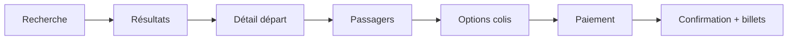
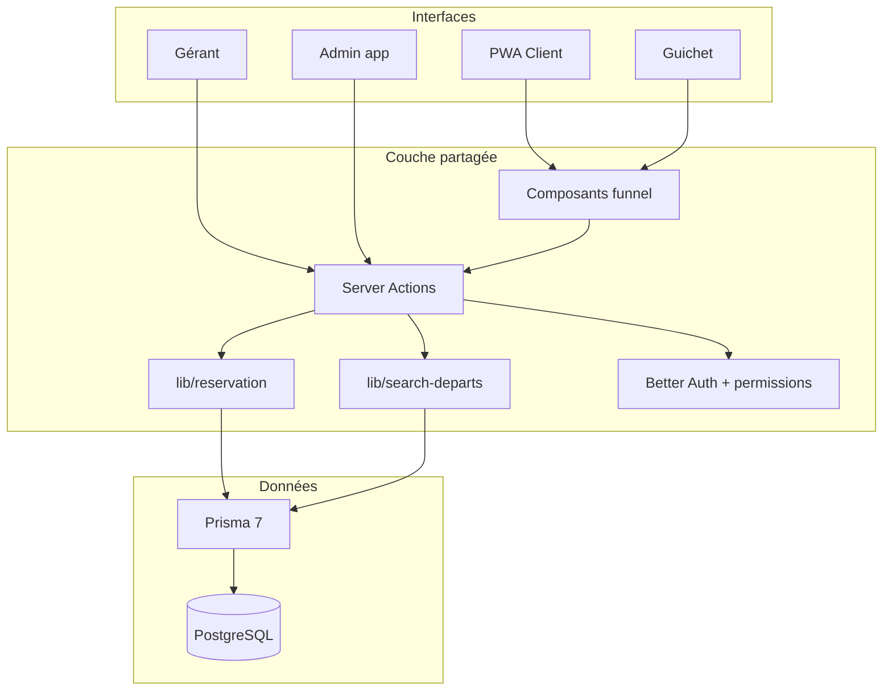

# Plan de restructuration — Réservation billets (avion & bus)

**Produit :** Coccinelle  
**Date :** 3 août 2026  
**Objectif :** Revoir complètement la logique de réservation et restructurer les interfaces Admin, Gérant, Guichetier et Client en ligne, avec une UX calquée sur les compagnies aériennes (simple, linéaire, intuitive).

---

## 1. Contexte et problème

### État actuel

| Zone | Situation |
|------|-----------|
| Guichet | Wizard fonctionnel (client → trajet → passagers → colis → paiement) mais dense, peu guidé, sans capacité ni mode transport |
| Admin / org | Pages agence hétérogènes ; dashboard mock ; navigation héritée (ex. « Smart Church ») |
| Gérant | Pas d’espace dédié : confondu avec l’admin org |
| Client en ligne | Non branché (`ReservationDraft` en schéma seulement) |
| Métier | Bus et avion non différenciés ; pas de places restantes ; pas de parcours « type airline » |

### Problème UX

Le parcours ne ressemble pas à une billetterie moderne. Les compagnies aériennes ont imposé un **funnel universel** que les utilisateurs connaissent déjà :

```text
Recherche → Résultats → Choix du départ → Passagers → Options → Paiement → Confirmation
```

Coccinelle doit adopter ce même mental model pour **tous** les canaux (en ligne, guichet), avec des écrans adaptés au rôle.

### Objectif produit

Une seule logique métier de réservation, exposée via **quatre interfaces** clairement séparées, toutes intuitives, en français, montants en CDF.

---

## 2. Principes UX (référence compagnies aériennes)

1. **Un funnel, plusieurs peaux** — Même étapes métier ; UI différente selon le rôle (client mobile vs agent rapide vs gérant pilotage).
2. **Recherche d’abord** — Départ / arrivée / date / mode (bus|avion) avant toute fiche client ou formulaire long.
3. **Prix visibles tôt** — « À partir de X CDF » dès les résultats ; récap permanent jusqu’au paiement.
4. **Une décision par écran** — Pas de formulaire monolithe ; stepper clair (progress bar).
5. **Feedback immédiat** — Places restantes, indisponibilité, erreurs de capacité avant soumission.
6. **Confirmation riche** — Code réservation, QR passagers, PDF billet, prochaines actions (imprimer, partager, modifier).
7. **Moins de jargon** — Vocabulaire voyageur (« Aller », « Passagers », « Paiement ») plutôt que termes techniques internes.



---

## 3. Acteurs et espaces à restructurer

| Acteur | Espace cible | Intention |
|--------|--------------|-----------|
| **Admin application** | `/admin` | Super-admin : orgs, rôles globaux, santé système |
| **Owner (créateur org)** | Supervision org + droits max | Crée l’org, veille sur l’agence |
| **Gérant (gestionnaire)** | `/agence/[orgId]/gerant` | Pilotage : planning, tarifs, capacité, CA, équipe — **ne crée pas** l’org |
| **Guichetier** | `/agence/[orgId]/guichet` | Vente rapide au comptoir, encaissement, réimpression |
| **Client en ligne** | `/[orgSlug]/…` (PWA) | Self-service réservation + mes billets |

> Les chemins ci-dessus sont une **proposition de cible**. L’existant sous `/admin/organizations/[organizationId]/agences/…` sera migré progressivement.

### Matrice de responsabilités

| Capacité | Admin plateforme | Owner | Gérant | Guichetier | Client |
|----------|:-----------------:|:----:|:------:|:----------:|:------:|
| CRUD organisations plateforme | ✓ | | | | |
| Créer une organisation | ✓ | ✓ | | | |
| Définir trajets, tarifs, programmes | | ✓ | ✓ | lecture | |
| Ouvrir / fermer / annuler un départ | | ✓ | ✓ | lecture | |
| Capacité bus/avion par départ | | ✓ | ✓ | lecture | |
| Créer réservation (cash / MM) | | ✓ | optionnel | ✓ | ✓ (payé) |
| Modifier / annuler / reporter | | ✓ | ✓ | ✓ (règles) | ✓ (règles) |
| Embarquement QR | | ✓ | | ✓ | |
| Dashboard CA / remplissage | | ✓ | ✓ | KPI jour | |
| Réserver en self-service | | | | | ✓ |
| Consulter ses billets | | | | | ✓ |

---

## 4. Parcours métier unifié (cœur de la restructuration)

### 4.1 Funnel commun (domaine)

Indépendamment de l’UI, le domaine suit :

1. **Sélection d’offre** — `Trajet` + `TrajetDepart` (mode BUS|AVION, places restantes)
2. **Composition voyage** — N passagers (ADULTE / ENFANT / BEBE) + colis optionnel
3. **Titulaire** — Client payeur (créé au guichet ou compte connecté en ligne)
4. **Tarification** — Calcul déterministe (`lib/reservation/pricing.ts` étendu)
5. **Paiement** — Cash / Mobile Money / Carte → statut
6. **Émission** — Codes `RES-*` / `PASS-*`, QR, PDF
7. **Post-vente** — Report, annulation, pénalité, embarquement

### 4.2 Différences canal

| Étape | Client en ligne | Guichet |
|-------|-----------------|---------|
| Recherche | Self-service | Agent lance la recherche avec le client |
| Compte | Auth obligatoire avant paiement | Création / recherche client assistée |
| Paiement | Digital confirmé → `CONFIRME` | Cash → `PAYE` immédiat ; sinon `EN_ATTENTE` |
| Billet | PDF + QR + historique | Impression + éventuel envoi email |
| Vitesse | Guidé, mobile-first | Raccourcis clavier, sections denses, mode « express » |

### 4.3 Règles métier à figer (prérequis)

- `modeTransport` : `BUS` | `AVION` sur `Trajet`
- `capacitePlaces` sur `TrajetDepart` + contrôle atomique des places restantes
- Bébé : `occupePlace = false`
- Colis seul autorisé (`nombrePlaces = 0`) avec destinataire obligatoire
- Plafond places par réservation (ex. 9 en ligne, 20 au guichet — à valider)
- Une seule API domaine : `createReservationInDatabase({ source })` pour tous les canaux

---

## 5. Restructuration par interface

### 5.1 Client en ligne — UX type compagnie aérienne

**Objectif :** Un voyageur réserve en &lt; 3 minutes sur mobile.

| Écran | Contenu | Inspiration |
|-------|---------|-------------|
| Accueil org | Marque agence + barre recherche (Départ, Arrivée, Date, Bus/Avion) | Home airline |
| Résultats | Liste triée (heure / prix), badges places, prix dès | Flight results |
| Détail | Horaires, durée, tarif par catégorie, CTA « Continuer » | Flight details |
| Passagers | Stepper N voyageurs, catégories, pièces d’identité si requises | Passenger details |
| Options | Colis / bagage ; destinataire si colis | Ancillaries |
| Paiement | Récap + MM / carte | Checkout |
| Confirmation | Code, QR, PDF, « Mes réservations » | Booking confirmed |
| Espace « Mes billets » | Historique, téléchargement, annulation/report selon règles | My trips |

**Routes proposées :**

```text
/[orgSlug]                          # accueil + recherche
/[orgSlug]/recherche               # résultats (?from&to&date&mode)
/[orgSlug]/departs/[departId]      # détail + CTA
/[orgSlug]/checkout/[draftToken]   # passagers → options → paiement
/[orgSlug]/confirmation/[code]     # post-paiement
/[orgSlug]/mes-reservations        # espace client
/[orgSlug]/mes-reservations/[id]
```

**Fondations :** brancher `ReservationDraft` (sauvegarde auto, expiration), `source: EN_LIGNE`.

---

### 5.2 Guichetier — UX vente rapide

**Objectif :** Vendre sans friction pendant qu’un client est au comptoir.

Restructurer le wizard actuel en **funnel airline accéléré** :

| Étape | UI guichet | Différence vs client |
|-------|------------|----------------------|
| 1. Recherche départ | Même moteur résultats, mode compact tablette | Filtres + « départs du jour » en 1 clic |
| 2. Client | Recherche / création inline (tel, nom) | Pas d’auth OTP |
| 3. Passagers | Grille rapide + templates (« 2 adultes ») | Saisie accélérée |
| 4. Colis | Panneau latéral optionnel | Destinataire obligatoire si colis |
| 5. Paiement | Espèces par défaut, montant rendu | Impression auto |
| 6. Ticket | Aperçu PDF + imprimer / WhatsApp | Retour immédiat à une nouvelle vente |

**Améliorations UX guichet :**

- Mode **« Vente express »** : départ du jour présélectionné → passagers → cash → print
- Bandeau **places restantes** toujours visible
- Raccourci **colis seul**
- File d’attente visuelle des 5 dernières ventes (réimpression)

**Routes proposées :**

```text
/agence/[orgId]/guichet                 # home agent (KPI jour + CTA vendre)
/agence/[orgId]/guichet/vendre          # funnel
/agence/[orgId]/guichet/reservations    # liste filtrée du jour
/agence/[orgId]/guichet/reservations/[id]
/agence/[orgId]/guichet/embarquement    # scan / liste départ
```

---

### 5.3 Gérant — UX pilotage

**Objectif :** Voir l’activité, préparer l’offre, contrôler l’équipe — pas vendre au comptoir toute la journée.

| Module | Contenu |
|--------|---------|
| Tableau de bord | CA jour/semaine, taux remplissage, départs du jour, alertes (complet, retard paiement) |
| Offre | Trajets (BUS/AVION), tarifs, programmes récurrents |
| Planning | Calendrier des départs, capacité, ouverture/fermeture, annulation |
| Réservations | Vue globale filtres (statut, source, paiement), actions exceptionnelles |
| Équipe | Membres, rôles guichetier / embarquement, permissions |
| Rapports | CA par trajet / mode paiement, export |
| Paramètres agence | Marque PWA (`orgSlug`), politiques report/annulation |

**Routes proposées :**

```text
/agence/[orgId]/gerant
/agence/[orgId]/gerant/planning
/agence/[orgId]/gerant/trajets
/agence/[orgId]/gerant/reservations
/agence/[orgId]/gerant/equipe
/agence/[orgId]/gerant/rapports
/agence/[orgId]/gerant/parametres
```

**Dashboard cible (remplace le mock actuel) :**

- KPI : réservations du jour, CA encaissé, places vendues / capacité, colis en attente
- Liste « prochains départs » avec jauge de remplissage
- Alertes actionnables (départ bientôt complet, paiements en attente)

---

### 5.4 Admin application — UX plateforme

**Objectif :** Gérer la multi-tenance, pas le métier transport.

| Module | Contenu |
|--------|---------|
| Organisations | Création, suspension, slug public |
| Rôles globaux | Super-admin / support |
| Observabilité | Santé auth, emails, erreurs (léger en V1) |
| Design system | `/design-system` conservé pour l’équipe |

Séparer clairement **admin plateforme** et **back-office agence** (aujourd’hui mélangés sous `/admin/organizations/.../agences`).

---

## 6. Restructuration informationnelle (IA / navigation)

### Navigation actuelle (problème)

- Sidebar générique peu liée au métier transport
- Modules agence (trajets, réservations, colis, passages, clients) au même niveau sans hiérarchie rôle
- Pages mock (colis, passages, dashboard) qui cassent la confiance UX

### Navigation cible par rôle

```text
Admin app
├── Organisations
├── Rôles
└── Paramètres plateforme

Gérant
├── Vue d’ensemble
├── Planning & départs
├── Trajets & tarifs
├── Réservations
├── Colis
├── Équipe
└── Rapports

Guichetier
├── Vendre
├── Réservations du jour
├── Embarquement
└── Clients (recherche)

Client
├── Rechercher
├── Mes réservations
└── Compte
```

### Design system & branding

- Remplacer les vestiges « Smart Church / Écodim » par l’identité Coccinelle
- Tokens CSS partagés ; peaux légères par espace (guichet dense, client aéré, gérant tableau)
- Composants funnel réutilisables : `SearchBar`, `DepartResultCard`, `PassengerForm`, `PriceSummary`, `CheckoutStepper`

---

## 7. Modèle de données — évolutions nécessaires

| Évolution | Entité | Pourquoi |
|-----------|--------|----------|
| `modeTransport` BUS\|AVION | `Trajet` | Filtre recherche + UX |
| `capacitePlaces` | `TrajetDepart` | Airline-like availability |
| Places restantes (calcul ou cache) | Domaine | Affichage résultats + lock à la vente |
| Destinataire colis | `Colis` | Remise à destination |
| Politiques report/annulation | Org ou Trajet | Post-vente claire |
| Brancher `ReservationDraft` | Déjà en schéma | Funnel en ligne |
| Optionnel V1.1 : siège / rangée | Passager | Avion seulement si besoin métier |

**Principe :** ne pas dupliquer les modèles guichet vs en ligne — unifier autour de `Reservation` + `source`.

---

## 8. Architecture technique cible



### Permissions — Better Auth uniquement

Source de vérité : plugin **organization** + `createAccessControl` (`lib/permissions.ts`), checks via `auth.api.hasPermission`. Détail : [U04](./units/U04-permissions-guichetier.md) + [units/INDEX.md](./units/INDEX.md).

| Rôle produit | Slug Better Auth | Permissions clés |
|--------------|------------------|------------------|
| Owner (crée l’org, supervise) | `owner` | Preset owner + toutes resources métier |
| Gérant (gère l’agence, **ne crée pas** l’org) | `gestionnaire` | `trajet:*`, `depart:*`, `rapport:read`, `equipe:…`, supervision réservations |
| Guichetier (comptoir) | `guichetier` (**nouveau slug**) | `inscription: create/share/update`, `depart:read`, `embarquement:…` |
| Client | `parent` | member ; self-service en ligne ; pas de guichet |
| Super-admin plateforme | `admin` (app) | Plugin admin — toutes orgs |

**U04** ajoute le rôle `guichetier` et aligne `gestionnaire` = gérant (pas vendeur comptoir).

---

## 9. Phasage de livraison

### Phase A — Fondations métier (1–2 semaines)

- Schéma : `modeTransport`, `capacitePlaces`, destinataire colis
- Contrôle places restantes dans `create-reservation.ts`
- Permissions guichetier
- Moteur de recherche départs partagé (`listDepartsDisponibles`)

### Phase B — Funnel unifié & guichet V2 (2–3 semaines)

- Composants funnel réutilisables
- Refonte guichet sur le funnel (recherche → … → confirmation)
- Impression / PDF billet minimal
- Suppression friction UX (express sale, places restantes)

### Phase C — Espace gérant (2 semaines)

- Nouveau shell navigation gérant
- Dashboard réel (KPI + départs)
- Planning capacité / ouverture départs
- Liste réservations avancée + rapports V1

### Phase D — Client en ligne PWA (3 semaines)

- Routes `/[orgSlug]/…`
- Drafts + checkout + confirmation
- Paiement digital (prestataire à trancher)
- Mes réservations + PDF/QR

### Phase E — Embarquement & colis réels (1–2 semaines)

- Remplacer mocks passages / colis
- Scan QR → `EMBARQUE`
- Flux colis `EN_ATTENTE` → `EXPEDIE` → `LIVRE`

### Phase F — Admin plateforme & polish (1 semaine)

- Séparation nette admin app vs agence
- Branding Coccinelle, navigation finale
- UAT multi-rôles, corrections UX

**Estimation globale :** ~10–13 semaines selon décisions paiement / PDF / SMS.

---

## 10. Critères de succès UX

| Critère | Mesure |
|---------|--------|
| Client réserve sans aide | Funnel complété en ≤ 5 écrans |
| Guichet vente cash | ≤ 90 s pour 1 adulte sur départ du jour |
| Compréhension rôles | Un utilisateur trouve son espace sans formation &gt; 10 min |
| Disponibilité | Impossible de surbooker un départ (test concurrence) |
| Confiance | Confirmation avec code + QR + PDF sur les 2 canaux |
| Cohérence | Même prix affiché résultats / récap / reçu |

---

## 11. Décisions à trancher avant / pendant le build

1. **Paiement Mobile Money RDC** — prestataire (Airtel, M-Pesa, autre) ?
2. **Sièges assignés** — nécessaires en V1 pour l’avion, ou simple quota de places ?
3. **Aller-retour** — V1 aller simple seulement, ou AR dès le départ ?
4. **Identité passager** — pièce obligatoire en ligne / au guichet ?
5. **Plafonds** — max passagers en ligne vs guichet
6. **Multi-guichets** — une org = une agence physique, ou plusieurs points de vente ?
7. **Notifications** — email seul en V1, ou SMS ?
8. **URL publique** — `orgSlug` customisable par le gérant ?

---

## 12. Livrables de ce plan

| Livrable | Description |
|----------|-------------|
| Ce document | Référence de restructuration UX + phasage |
| **Units d’implémentation** | [`context/units/INDEX.md`](./units/INDEX.md) — U01 → U18, chacune visible et testable |
| Maquettes / wireframes (suivant) | Funnel client + guichet + dashboard gérant |
| Doc conception existante | Aligner `doc/vision.md` et `doc/plan.md` sur ce plan |

### Mapping phases → units

| Phase | Units |
|-------|-------|
| A Fondations | [U01](./units/U01-mode-transport.md) · [U02](./units/U02-capacite-places.md) · [U03](./units/U03-destinataire-colis.md) · [U04](./units/U04-permissions-guichetier.md) · [U05](./units/U05-moteur-recherche-departs.md) |
| B Funnel & guichet | [U06](./units/U06-kit-composants-funnel.md) · [U07](./units/U07-guichet-v2-vente-express.md) · [U08](./units/U08-billet-pdf-qr.md) |
| C Gérant | [U09](./units/U09-shell-gerant.md) · [U10](./units/U10-dashboard-gerant.md) · [U11](./units/U11-planning-departs.md) · [U12](./units/U12-reservations-rapports-gerant.md) |
| D PWA client | [U13](./units/U13-pwa-recherche-resultats.md) · [U14](./units/U14-pwa-checkout-draft.md) · [U15](./units/U15-pwa-paiement-mes-billets.md) |
| E Ops | [U16](./units/U16-embarquement-qr.md) · [U17](./units/U17-gestion-colis.md) |
| F Polish | [U18](./units/U18-admin-branding.md) |

**À l’implémentation :** suivre la règle skills + MCPs décrite dans [`units/INDEX.md`](./units/INDEX.md).

---

## 13. Prochaines actions immédiates

1. Valider ce plan avec l’équipe métier (funnel airline + séparation Admin / Gérant / Guichet / Client).
2. Trancher les décisions §11 (surtout paiement et sièges).
3. Démarrer **U01** puis enchaîner selon [`units/INDEX.md`](./units/INDEX.md).
4. Produire wireframes haute fidélité du funnel client et du mode express guichet avant U06–U07.

---

## Références internes

- Vision actuelle : [`doc/vision.md`](../doc/vision.md)
- Plan conception module : [`doc/plan.md`](../doc/plan.md)
- Domaine réservation : `lib/reservation/`
- Guichet actuel : `app/admin/organizations/[organizationId]/agences/reservations/guichet/`
- Schéma : `prisma/schema.prisma`
