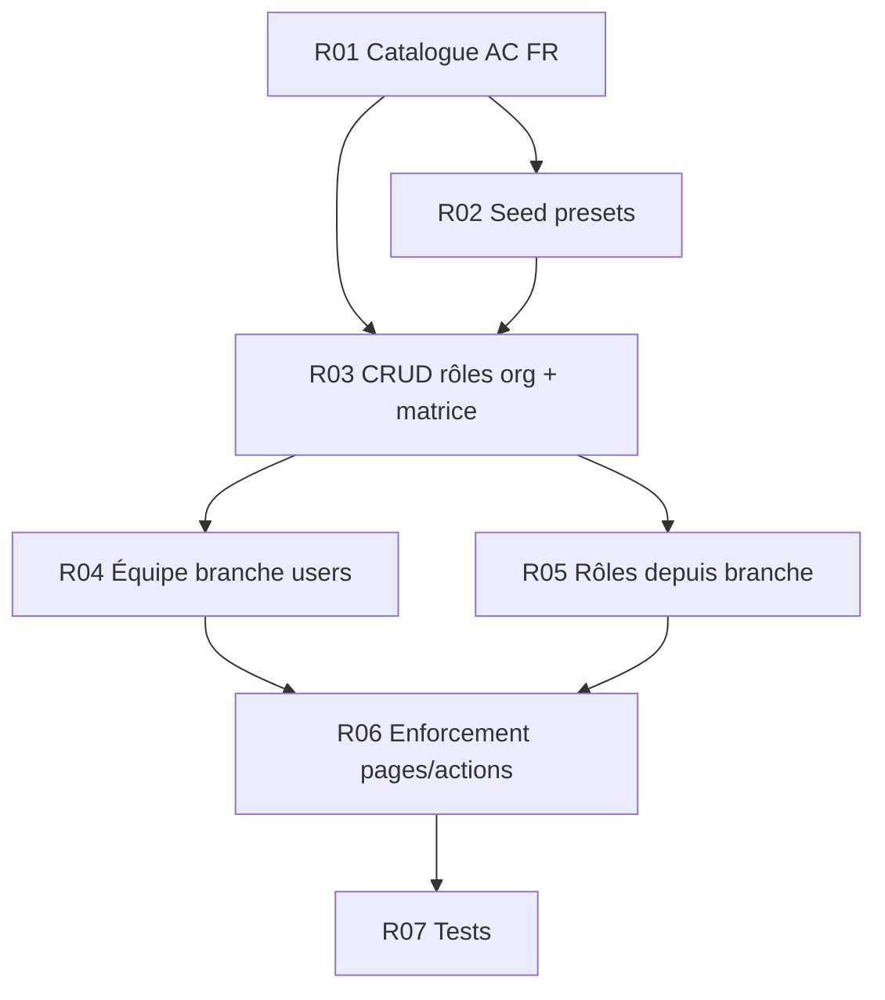

# Plan — Rôles custom dynamiques & permissions FR

| | |
|---|---|
| **Status** | `done` — units [`units-roles/`](./units-roles/INDEX.md) |
| **Périmètre** | Better Auth org DAC + catalogue permissions FR (99) + équipe / rôles depuis chaque branche |
| **Hors scope** | Rôles privés par branche ; éditer `admin` / `user` / `owner` ; rôle différent par branche (V1.1) |
| **Lié** | [U04](./units/U04-permissions-guichetier.md) (socle historique, à faire évoluer), [plan hospitalité rôles](./plan-roles-dashboards-hospitalite.md), Better Auth `dynamicAccessControl` |

---

## Modèle

### Rôles système Better Auth (non custom)

| Couche | Slug | Rôle |
|--------|------|------|
| Plateforme | `admin` | Super-admin app ; crée les orgs |
| Plateforme | `user` | Compte normal |
| Organisation | `owner` | Créateur d’org (`creatorRole`) — verrouillé |

### Rôles custom

Tout autre slug (`caissier`, `serveur`, `gerant`, `guichetier`, …) via `OrganizationRole` + matrice permissions. Créables depuis **l’org** et depuis **chaque établissement**.

### Organisation vs branche

- **Org** : stocke les rôles + permissions ; membres.
- **Branche** : établissement ; hub « Équipe » pour créer users, créer/éditer rôles, assigner un rôle, rattacher à la branche.

---

## Catalogue (99 permissions — termes FR)

Format : `Ressource · Action`. Actions : Voir, Ajouter, Modifier, Supprimer, Partager, Scanner, Annuler, Gérer, Assigner, Ouvrir, Fermer, Encaisser.

**Caisse** : Voir / Ouvrir / Fermer / Encaisser / Modifier (pas d’« Ajouter » ambigu).

**Source de vérité code** : `lib/permissions.ts` (`organizationProductStatements`) + libellés `lib/permission-labels-fr.ts`.

Clés code : slugs ASCII FR (ex. `caisse: ["voir","ouvrir","fermer","encaisser","modifier"]`). Presets seed : [R02](./units-roles/R02-seed-presets-migration.md).

---

## Ordre d’exécution

Voir [`units-roles/INDEX.md`](./units-roles/INDEX.md).

---

## Règles d’implémentation

1. Permissions = Better Auth uniquement (`hasPermission` / `assertOrganizationPermission`). Pas de RBAC parallèle.
2. MCP `user-better-auth` avant toute évolution AC / DAC.
3. Hub : carte visible si **Ressource · Voir** ; actions (Ouvrir, Encaisser…) gated séparément.
4. Remplacer progressivement `ROLE_CARDS` / `canSeeDashCard` par le catalogue.
5. `owner` : non créable, non supprimable, matrice non éditable.
