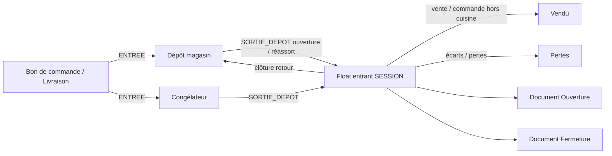

# Plan — Stock service F&B : dépôt, congélateur, float vendeur & clôture signée

| | |
|---|---|
| **Status** | `in_progress` — S0→S4 livrés (schéma, UI service stock, gate resto/caisse, float à la vente, docs ouverture/fermeture) |
| **Périmètre** | Branche `HOTEL` / `RESTAURANT` — produits **hors cuisine** (`needsKitchen = false`) : restauration (prise de commande) + **vente rapide** (caisse) |
| **Hors scope V1** | Boutique `ShopProduct` ; recettes / nomenclatures cuisine ; inventaire annuel comptable complet |
| **Lié** | [`plan-hotel-caisse-sejours-restauration.md`](./plan-hotel-caisse-sejours-restauration.md), [`plan-barcode-produits-pos.md`](./plan-barcode-produits-pos.md), bons de commande / entrées stock, session caisse (`CashSession`) |

---

## 1. Besoin métier (reformulé)

Aujourd’hui le stock F&B est un **seul compteur** (`HotelMenuItem.stockQty`) : bon de commande → entrée ; vente / livraison → sortie. Ça ne reflète pas le terrain :

1. Le **dépôt** (magasin + **congélateur**) détient le stock « vrai ».
2. À **l’ouverture** du service, le manager **attribue** au **nouvel entrant** (vendeur / serveur du shift) un **float** précis — **pas** tout le dépôt.
3. Le système **produit obligatoirement un document d’ouverture** : **nom de l’entrant**, état des lieux du float, quantités attribuées, zones (magasin / congélateur), signatures.
4. L’entrant **confirme** l’état des lieux (comptage) avant de vendre ; impression / aperçu du document d’ouverture.
5. **Pendant le service**, si le float est insuffisant / rupture, le **manager peut rajouter des produits** depuis le dépôt **s’il reste du stock** (réassort mid-shift) — chaque ajout met à jour le float et peut générer un **avenant** (ou réimpression de l’état).
6. Seules les ventes / commandes **hors cuisine** débitent le float.
7. Le **restaurant** n’encaisse pas : il exécute les commandes. L’argent = caisse / vente rapide.
8. À la **fermeture**, document de **clôture** : état restant, montant vendu, détail produit / PU / qté, écarts — signatures **entrant + manager**.

Analogie : **session caisse** → **session stock service** (ouverture documentée + clôture signée).

---

## 2. Améliorations retenues (idée → réalité terrain)

| Idée brute | Décision | Pourquoi |
|------------|----------|----------|
| « État des lieux de tous les produits » | **Uniquement le float attribué** (hors cuisine) | Inventaire complet = trop long à chaque shift |
| « Nom de la nouvelle entrant » | Champ obligatoire **`vendorUserId` + nom affiché** sur doc ouverture / fermeture | Responsabilité claire du shift |
| Document à l’ouverture | **Document Ouverture** généré par le système (aperçu + impression) | Preuve de prise en charge |
| Document à la fermeture | **Document Fermeture** (état restant + CA + détail ventes) | Preuve de rendu de compte |
| Manager rajoute des produits | **Réassort mid-shift** depuis dépôt/congélateur **si stock dépôt > 0** | Terrain : rupture float, dépôt encore fourni |
| Plus de stock dépôt | UI : produit **indisponible** / qté max = solde dépôt ; pas d’attribution fantôme | Pas de float négatif magasin |
| Congélateur | Zone `CONGELATEUR` ; sortie → float avant vente | Traçabilité + hygiène |
| Resto + vente rapide | 1 session stock partagée / jour (défaut) ou 2 (param) | Même hors cuisine souvent |
| Décrément `stockQty` à la vente | Vente → float ; dépôt → seulement attribution / retour / BC | Dépôt ≠ comptoir |

### Règles métier V1 (non négociables)

1. **Identité de l’entrant** — toute session a un **vendeur / entrant nommé** (utilisateur branche) ; ce nom figure sur **Ouverture** et **Fermeture**.
2. **Document Ouverture obligatoire** — après attribution + confirmation état des lieux : aperçu + impression (ou téléchargement) avant unlock des ventes hors cuisine.
3. **Document Fermeture obligatoire** — à la clôture : aperçu + impression avec état restant + ventes + signatures.
4. **Attribution initiale** — manager compose le float depuis dépôt / congélateur (stock dispo seulement).
5. **Réassort manager** — pendant `OPEN`, manager peut **ajouter** (ou retirer avec motif) des lignes / quantités si dépôt suffisant ; l’état float se met à jour ; option **réimprimer** l’état / avenant.
6. **État des lieux ouverture** — entrant confirme `qtyOpeningCounted` ; écarts → motif + validation manager.
7. **Ventes** — hors cuisine uniquement sur float restant ; rupture float → blocage (proposer réassort manager).
8. **Restaurant ≠ caisse** — resto = commandes ; pas d’encaissement dans la session stock.
9. **Clôture** — comptage restant, CA, détail, écarts, signatures, retour dépôt.

---

## 3. Terminologie UI

| Terme | Sens |
|-------|------|
| **Entrant** | Vendeur / serveur responsable du float pour la session (nom sur les docs) |
| **Dépôt** | Magasin central |
| **Congélateur** | Zone dépôt |
| **Float / stock service** | Quantités en charge de l’entrant |
| **Document Ouverture** | État des lieux initial + identité entrant |
| **Document Fermeture** | État final + ventes + signatures |
| **Réassort** | Ajout manager de produits / qté depuis le dépôt pendant le service |
| **Avenant ouverture** | Réimpression / complément après réassort (option V1 : réimprimer l’état à jour) |
| **Écart** | Théorique vs compté |

**Libellés proposés :**

```text
[ Ouvrir le service ] → Choisir l’entrant → Attribuer depuis dépôt
[ État des lieux ] → Document Ouverture (aperçu / imprimer)
… service …
[ Réassort manager ] (si rupture / besoin)
[ Clôturer ] → Document Fermeture (aperçu / imprimer) → Signatures
```

---

## 4. Architecture cible (simple)



### 4.1 Entités proposées (V1)

**`ServiceStockSession`**

| Champ | Rôle |
|-------|------|
| `id`, `branchId`, `number` (ex. `SS-00012`) | Identité |
| `status` `DRAFT` \| `OPEN` \| `CLOSING` \| `CLOSED` | Cycle |
| `vendorUserId` | **Entrant** (obligatoire) |
| `vendorDisplayName` | Snapshot nom au moment de l’ouverture (doc stable même si user renommé) |
| `openedByUserId` / `closedByManagerUserId` | Manager |
| `openedAt` / `closedAt` | Horodatage |
| `openingConfirmedAt` | État des lieux ouverture validé |
| `openingDocumentPrintedAt` | Doc ouverture généré / imprimé |
| `closingDocumentPrintedAt` | Doc fermeture |
| `notes` | Optionnel |

**`ServiceStockLine`**

| Champ | Rôle |
|-------|------|
| `sessionId`, `menuItemId` | Produit hors cuisine |
| `qtyAttributed` | Total attribué (ouverture **+** réassorts) |
| `qtyOpeningCounted` | Compté à l’état des lieux initial |
| `qtySold` | Cumul vendu |
| `qtyClosingCounted` | Compté à la fermeture |
| `qtyReturnedToDepot` | Retour magasin |
| `qtyLoss` | Pertes |
| `unitPriceUsd` | Snapshot PU vente |
| `sourceZone` `MAGASIN` \| `CONGELATEUR` | Dernière / principale provenance |

**`ServiceStockTopUp`** (réassort mid-shift — recommandé V1)

| Champ | Rôle |
|-------|------|
| `sessionId`, `menuItemId`, `quantity` | Ajout |
| `sourceZone` | Magasin / congélateur |
| `createdByUserId`, `createdAt` | Manager qui rajoute |
| `note` | Motif (réassort, rupture, etc.) |

Chaque top-up : `SORTIE_DEPOT` + `qtyAttributed += quantity` ; le document d’état peut être **régénéré** (état à jour).

**Mouvements**

| `kind` | Effet |
|--------|--------|
| `ENTREE_DEPOT` | + dépôt (BC / livraison) |
| `SORTIE_DEPOT` | − dépôt, + float (ouverture **ou** réassort) |
| `VENTE_SERVICE` | − float |
| `RETOUR_DEPOT` | − float, + dépôt (clôture) |
| `PERTE_SERVICE` | − float |

> **Stock dépôt insuffisant** : le manager ne peut pas attribuer / réassortir au-delà du solde ; message « Stock dépôt insuffisant ».

### 4.2 Qui consomme le float ?

| Surface | Argent | Stock hors cuisine |
|---------|--------|--------------------|
| **Restauration** | Non | Float session OPEN + doc ouverture fait |
| **Vente rapide** | Oui (`CashSession`) | Idem |
| **Cuisine** | — | Hors float vendeur |
| **Livraison** | — | Consommables inchangés |

---

## 5. Parcours UX

### 5.1 Ouverture (manager + nouvel entrant)

1. **Choisir l’entrant** (liste membres branche / rôle vendeur) — nom figé sur la session.
2. Manager **attribue** les produits depuis dépôt / congélateur (qté ≤ stock dispo).
3. Entrant fait l’**état des lieux** (confirmation / comptage).
4. Système génère le **Document Ouverture** :
   - Nom de l’entrant (et manager)
   - N° session, date/heure
   - Tableau état des lieux (produit, zone, qté attribuée, qté confirmée)
   - Mentions de prise en charge + signatures
5. **Aperçu + Imprimer** (obligatoire ou fortement imposé avant unlock).
6. Unlock resto / vente rapide hors cuisine.

### 5.2 Pendant le service — réassort manager

1. Float bas / rupture → message « Demander un réassort ».
2. Manager ouvre **Réassort** : ajoute produit(s) ou qté **si dépôt / congélateur a du stock**.
3. Float mis à jour immédiatement ; ventes peuvent reprendre.
4. Option : **régénérer / réimprimer** l’état (avenant) avec nom de l’entrant + nouvelles lignes / qté totales.

### 5.3 Fermeture

1. Entrant (ou manager) lance **Clôturer**.
2. Saisie **état restant** compté par ligne.
3. Calcul : `théorique = qtyAttributed − qtySold − qtyLoss` ; `écart = compté − théorique`.
4. **Document Fermeture** (aperçu + impression) :
   - Nom de l’entrant + manager clôture
   - CA session + détail ventes (produit, PU, qté, total)
   - État : attribué (dont réassorts) · vendu · restant · retour dépôt · écarts
   - Signatures entrant + manager
5. Retours dépôt + session `CLOSED`.

---

## 6. Documents imprimables (paire Ouverture / Fermeture)

### 6.1 Document Ouverture — « État des lieux — prise de service »

| Bloc | Contenu |
|------|---------|
| En-tête | Branche, n° session `SS-…`, date/heure ouverture |
| **Entrant** | **Nom complet** (snapshot) + éventuellement matricule / rôle |
| Manager | Nom de qui a ouvert / attribué |
| Tableau | Produit · zone (magasin/congélateur) · qté attribuée · qté confirmée (état des lieux) |
| Mentions | « Je soussigné(e) [Nom entrant], reconnais avoir pris en charge le stock ci-dessus pour le service. » |
| Signatures | **Entrant** · **Manager** |

Régénération après réassort : même titre + mention « État mis à jour le … (réassort) » + total qté à jour.

### 6.2 Document Fermeture — « Rapport de clôture — fin de service »

| Bloc | Contenu |
|------|---------|
| En-tête | Branche, n° session, heure ouverture / fermeture |
| **Entrant** | **Nom** (même snapshot) |
| Manager clôture | Nom |
| **CA** | Montant total vendu (hors cuisine session) |
| Détail ventes | Produit · PU · qté · total ligne |
| **État stock** | Attribué · vendu · restant compté · retour dépôt · pertes / écarts |
| Mentions | Remise du reliquat / responsabilité des écarts |
| Signatures | **Entrant** · **Manager** |

Réutiliser le pattern iframe print (bons de commande / dépenses).

---

## 7. Phases d’exécution

### Phase S0 — Cadrage & modèle (0,5–1 j)

- [x] Valider : 1 session partagée resto+vente rapide (défaut)
- [x] `stockQty` = dépôt ; float = lignes session
- [x] Schéma + snapshot **nom entrant**
- [x] Docs Ouverture / Fermeture

### Phase S1 — Session + attribution + identité entrant (2–3 j)

- [x] Models session / lignes / top-up
- [x] Sélection **entrant** à l’ouverture
- [x] Attribution depuis dépôt / congélateur (plafond = stock dispo)
- [x] UI manager + carte dashboard

### Phase S2 — État des lieux + Document Ouverture + gate (2 j)

- [x] Confirmation état des lieux par l’entrant
- [x] Aperçu + impression Document Ouverture
- [x] Gate resto / vente rapide hors cuisine
- [x] Blocage si dépôt insuffisant à l’attribution

### Phase S3 — Ventes sur float + réassort manager (2–3 j)

- [x] Décrément float (resto + vente rapide hors cuisine)
- [x] Affichage restant float dans POS
- [x] Réassort manager mid-shift (si stock dépôt)
- [x] Régénération / réimpression état après réassort

### Phase S4 — Document Fermeture + signatures (2 j)

- [x] Comptage restant + écarts / pertes
- [x] CA + détail ventes
- [x] Aperçu + impression Document Fermeture
- [x] Retour dépôt + `CLOSED`

### Phase S5 — Congélateur & durcissement (1–2 j)

- [x] Zone `storageZone` MAGASIN / CONGELATEUR
- [ ] Alertes session non clôturée / écarts
- [ ] Rapport manager période

### Phase S6 — Polish (optionnel)

- [ ] Packs d’attribution (« Softs soir »)
- [ ] Scan code-barres sur état des lieux
- [ ] Multi-entrants / multi-floats le même jour
- [ ] Historique PDF des docs session

---

## 8. Impacts code (indicatif)

| Zone | Changement |
|------|------------|
| `prisma/schema.prisma` | Session, lignes, top-up, zones, kinds mouvements |
| `lib/hotel/service-stock.ts` | Ouverture, réassort, clôture, snapshots noms |
| Print helpers | Templates **Ouverture** / **Fermeture** |
| `restauration-client` / `caisse-client` | Gate + float |
| `pos-terminal.tsx` | Stock = restant float |
| `branch-menus.ts` | Carte Service stock |

---

## 9. Risques & garde-fous

| Risque | Mitigation |
|--------|------------|
| Attribution sans stock dépôt | Plafond UI + contrôle serveur |
| Doc ouverture sans nom | `vendorUserId` + `vendorDisplayName` obligatoires |
| Réassort oublié dans le doc fermeture | `qtyAttributed` = somme ouverture + top-ups |
| Double stock | Dépôt = vérité ; float = session |
| Session sans clôture | Alerte + blocage nouvelle session conflictuelle |

---

## 10. Critères d’acceptation globaux

1. **Ouverture** : choix de l’entrant → attribution → état des lieux → **Document Ouverture** (nom + état) imprimable.
2. **Réassort** : manager ajoute des produits **si stock dépôt** ; float et état se mettent à jour.
3. **Service** : resto = commandes ; vente rapide = encaissement ; hors cuisine = float.
4. **Fermeture** : **Document Fermeture** (nom entrant + état restant + CA + détail) + signatures.
5. Dépôt ne diminue qu’aux sorties dépôt (ouverture / réassort), jamais « en silence » à la vente.

---

## 11. Ordre recommandé

`S0 → S1 → S2 → S3 → S4 → S5` (+ `S6`)

**Prochaine action :** valider S0 (session unique resto+vente rapide + modèle docs), puis S1 (entrant nommé + attribution).
