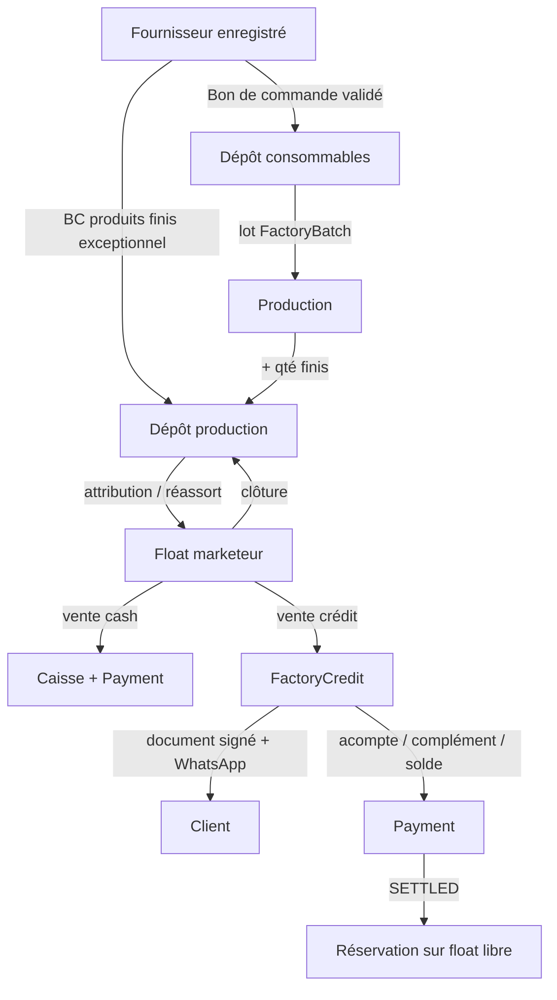

# Plan — Branche Usine (production eau / vins · vente cash & crédit · marketeur)

| | |
|---|---|
| **Status** | `done` — V1 implémentée (U0–U9) |
| **Périmètre V1** | Nouveau `BranchType = USINE` · famille **commerce** (même paie / bulletins que `BOUTIQUE`) · production **eau** et/ou **vins** · vente **cash** ou **crédit** · rôle **marketeur** · stock dépôt + float auxiliaire |
| **UX** | Dashboard-first (cartes hub USINE) · même pattern que Boutique POS / Service stock resto / Paie commerce |
| **Notifs** | WhatsApp Zindua (+ email si dispo) · branding `Branch.name` ([`plan-notifications-email-whatsapp.md`](./plan-notifications-email-whatsapp.md)) |
| **Lié** | [`plan-paie-agents-commerce.md`](./plan-paie-agents-commerce.md) · [`plan-stock-service-depot-float.md`](./plan-stock-service-depot-float.md) · [`plan-commerce-pos-panier.md`](./plan-commerce-pos-panier.md) · bons de commande (`PurchaseOrder`) · [`plan-clients-partenaires-hotel.md`](./plan-clients-partenaires-hotel.md) (CRM / crédit) |

---

## 1. Besoin métier (reformulé)

Une **usine** n’est pas une boutique de détail ni un restaurant, mais elle **réutilise** deux mécaniques déjà éprouvées :

1. **Paie & bulletins** — comme la boutique (`journalier USD → période mensuelle → bulletin figé`).
2. **Stock à deux étages** — comme le restaurant : **dépôt** (vrai stock) + **stock auxiliaire / float** attribué au **marketeur** (pas tout le dépôt).

Le métier spécifique :

1. On **produit** de l’**eau** et/ou des **vins** (lots, consommables, recettes).
2. On **vend** au client : **cash** (immédiat) ou **crédit** (emporté maintenant, payer plus tard).
3. En **crédit** : on identifie le client (**nom, contact, téléphone**, **société optionnelle**), la **quantité**, le **montant**, la **date d’échéance**, et on sort un **document à signer**.
4. Le **marketeur** vend depuis **son** float (stock auxiliaire libre).
5. WhatsApp informe le client : **qté prise**, **montant**, **date de paiement** ; relances ; prolongation d’échéance ; paiements par **tranche**.
6. Tranches : **acompte** → **complément(s)** → **solde**. Tout client usine peut **réserver** du float (dette ouverte ou pas).
7. Tout petit article (bouchons, étiquettes, sachets, filtres, sucre, levure, jerricans, etc.) passe par un **bon de commande** vers un **fournisseur enregistré**. Rien n’entre au dépôt « à la main » sans BC validé.

**Analogies Coccinelle (ne pas réinventer)**

| Usine | Réutiliser |
|-------|------------|
| Paie / présences / bulletins | Hub BOUTIQUE `personnelPaieSection` + `isCommerceBranchType` étendu à `USINE` |
| Dépôt vs float marketeur | `ServiceStockSession` resto/boutique (ouverture, réassort, clôture signée) |
| Catalogue produits finis | `ShopProduct` (ou catalogue usine dédié, même UX Produits) |
| Consommables + BC | `PurchaseOrder` + fiche **fournisseur** (au lieu du seul `supplierName` libre) |
| Client crédit | CRM type `BranchPartner` **simplifié** (pas de pièce d’identité V1) |
| Encaissement cash | `CashSession` + `Payment` |
| Document signé | Même esprit que doc ouverture service stock / dépense (aperçu + impression) |

---

## 2. Améliorations retenues (idée → réalité terrain)

| Idée brute | Décision V1 | Pourquoi |
|------------|-------------|----------|
| « Type usine dans le commerce » | **`BranchType.USINE`** (1er niveau, comme `RESTAURANT` vs `HOTEL`) — **pas** un flag caché de `BOUTIQUE` | Hub, guards, bootstrap et rapports distincts ; paie partagée via famille commerce |
| Eau **et** vins | Flags `hasEau` / `hasVin` (au moins un à la création) | Une usine peut ne faire que l’eau |
| Marketeur = caissier boutique | Rôle seed **`marketeur`** : vend cash/crédit + float ; **ne** gère **pas** le dépôt ni la production | Responsabilité claire du stock emporté |
| Vente crédit « au feeling » | Dossier **`FactoryCredit`** obligatoire avant sortie stock | Audit + WhatsApp + document |
| Identité client | Fiche **`FactoryCustomer`** : nom, téléphone (obligatoire crédit), contact, société optionnelle | Réutiliser le client au 2ᵉ crédit |
| Document à signer | **Bon de crédit / livraison** PDF + aperçu (qté, PU, total, échéance, signatures client + marketeur) | Preuve terrain, même si le PDF n’est pas un scan manuscrit |
| WhatsApp | Envoi à la **création crédit**, **chaque paiement**, **prolongation**, **J−1 / jour J** échéance | Le client n’oublie pas ; le marketeur n’a pas à relancer à la main |
| Prolonger l’échéance | Action **`EXTEND`** : nouvelle date + motif + historique ; **pas** d’effacement de l’ancienne | Traçabilité ; notif WhatsApp |
| Payer par tranche | `PaymentKind` : `ACOMPTE` \| `COMPLEMENT` \| `SOLDE` · solde restant toujours visible | Vocabulaire métier demandé |
| « Si tout payé → réservation stock » | **Tout client usine** peut `FactoryReservation` sur le **float libre** | Pas de blocage si crédit ouvert |
| Stock auxiliaire libre | Float marketeur − qté déjà **réservées** − qté **en crédit non livrées** (si applicable) | On ne promet pas du stock déjà promis |
| Consommables | Catalogue **`CONSUMABLE`** (pas vendable) ; sortie seulement via **ordre de production** | Évite de vendre des bouchons au POS |
| Production | **`FactoryBatch`** : recette (BOM) → − consommables dépôt, + produits finis dépôt | Le stock « magique » est interdit |
| Petites choses | **Tout** entrée dépôt = ligne de **bon de commande** validé + fournisseur **enregistré** | Pas d’achat fantôme |
| Fournisseur | Modèle **`BranchSupplier`** (nom, tel, contact, notes) · BC lié par `supplierId` | Aujourd’hui `PurchaseOrder.supplierName` est un texte libre |
| Cash usine | Session caisse comme boutique ; vente cash débite le **float marketeur** | Cohérent resto/boutique |
| Un seul stock magasin | **Dépôt** (zones `PRODUCTION` / `CONSOMMABLES`) + **float par marketeur** | Comme magasin + float resto |

### Règles métier V1 (non négociables)

1. **Famille commerce** — `USINE` a **Équipe + Présences + Paie du mois + Mes jours + bulletins** identiques à `BOUTIQUE` (étendre `isCommerceBranchType`).
2. **Identité marketeur** — toute session float a un `vendorUserId` (marketeur) nommé sur les docs ouverture / clôture.
3. **Vendre ≠ dépôt** — le marketeur ne sort **jamais** du dépôt directement ; seulement de **son float** (réassort = gérant / magasinier).
4. **Crédit nommé** — pas de crédit anonyme. Téléphone **obligatoire** (WhatsApp). Société **optionnelle**.
5. **Document crédit obligatoire** — après saisie : aperçu + impression / PDF **avant** (ou au moment de) la sortie float. Champ `documentIssuedAt`.
6. **WhatsApp ne bloque pas** — échec canal = log + toast ; le dossier reste créé.
7. **Échéance** — date ≥ aujourd’hui (timezone branche). Prolongation = nouvelle date **strictement postérieure** + motif.
8. **Tranches** — `restant = total − sum(paiements)`. `SOLDE` seulement si le paiement **clôture** le restant (tolérance 0,01 USD). `ACOMPTE` = 1er paiement si restant était = total. Sinon `COMPLEMENT`.
9. **Réservation** — `FactoryReservation` pour **tout client** de la branche (dette ouverte ou pas). Qté ≤ float **libre** du marketeur. Expiration date (défaut 7 j) sinon libération auto.
10. **Production** — aucun produit fini n’apparaît au dépôt sans `FactoryBatch` `VALIDATED` (ou BC de produit fini exceptionnel : rachat / transfert, motif).
11. **Consommables** — entrée uniquement via BC validé ; sortie uniquement via batch de production (ou perte documentée).
12. **Fournisseur enregistré** — on ne valide pas un BC usine avec un nom tapé une fois : fiche `BranchSupplier` ACTIVE.
13. **On n’efface jamais** un crédit, un paiement, une prolongation, un batch. Annulation = statut `CANCELLED` + motif.
14. **Devise** — montants USD ; affichage CDF via `ExchangeRate` branche (snapshot sur le document crédit).

---

## 3. Vocabulaire (à coller dans le produit)

| Terme UI | Sens |
|----------|------|
| **Usine** | Branche `USINE` (eau et/ou vins) |
| **Dépôt production** | Stock des **produits finis** (casiers eau, bouteilles vin, etc.) |
| **Dépôt consommables** | Intrants & petits articles (bouchons, étiquettes, filtres, sachets…) |
| **Float / stock auxiliaire** | Quantités **en charge du marketeur** (comme le float resto) |
| **Libre** | Float − réservations actives − (option) crédits en cours non encore emportés |
| **Marketeur** | Rôle qui vend cash/crédit et porte le float |
| **Client usine** | Fiche `FactoryCustomer` (personne ± société) |
| **Vente cash** | Encaissement immédiat, sortie float, reçu caisse |
| **Crédit** | Emporté maintenant, payé plus tard (`FactoryCredit`) |
| **Échéance** | Date limite de paiement |
| **Prolongation** | Nouvelle échéance + motif, historisée |
| **Acompte** | Premier paiement partiel |
| **Complément** | Paiement suivant, restant > 0 |
| **Solde** | Paiement qui ramène le restant à 0 |
| **Soldé** | Crédit entièrement payé → droit de **réserver** |
| **Réservation stock** | Blocage de qté sur le float libre du marketeur |
| **Lot / production** | `FactoryBatch` : on consomme des intrants, on sort des finis |
| **Recette / BOM** | Nomenclature : X consommables → 1 unité de fini |
| **Bon de commande** | `PurchaseOrder` vers un **fournisseur enregistré** |
| **Document de crédit** | Bon à signer (client + marketeur) |

**Libellés proposés**

```text
[ Ouvrir le float marketeur ] → Attribuer depuis dépôt production
[ Vendre cash ]               → Panier → caisse
[ Vendre à crédit ]           → Client → qté → échéance → document à signer → WhatsApp
[ Encaisser crédit ]          → Acompte / Complément / Solde
[ Prolonger l’échéance ]      → Motif + nouvelle date → WhatsApp
[ Réserver ]                  → Client usine + qté libre marketeur
[ Produire un lot ]           → Recette → − consommables + finis dépôt
[ Bon de commande ]           → Fournisseur enregistré → validation → entrée dépôt
```

---

## 4. Type de branche & création

### 4.1 Enum

Étendre Prisma :

```prisma
enum BranchType {
  AGENCE
  HOTEL
  BOUTIQUE
  RESTAURANT
  USINE
}
```

Sur `Branch` :

| Champ | Rôle |
|-------|------|
| `hasEau` | Production / vente **eau** |
| `hasVin` | Production / vente **vins** |

Règle : `(hasEau \|\| hasVin) === true` à la création. Aucun module → invalide.

Libellé UI : **Usine** (sous-titre : Eau · Vins selon flags).

### 4.2 Famille commerce (paie)

```ts
function isCommerceBranchType(type: string) {
  const t = type.toUpperCase();
  return t === "BOUTIQUE" || t === "USINE";
}
```

À brancher dans : `lib/payroll/bootstrap.ts`, hub `personnelPaieSection`, équipe (`isCommerce`), cartes Présences / Paie / Mes jours.

Les **routes paie** peuvent rester sous `boutique/paie/*` en V1 (comme `/hotel/*` pour `RESTAURANT`) **ou** alias `usine/paie/*` → mêmes actions. Décision V1 : **réutiliser `boutiqueRoutes.paie*`** + hub USINE qui pointe dessus (moins de refacto) ; alias `usine/` plus tard.

### 4.3 Chemins URL

Préfixe module **`/usine/`** :

```text
.../branches/[branchId]/usine/
    pos/                 → vente cash (panier)
    credits/             → crédits (liste, fiche, encaisser, prolonger, document)
    clients/             → fiches clients usine
    reservations/        → réservations stock auxiliaire
    produits/            → catalogue finis + consommables
    depot/               → stock dépôt (zones production / consommables)
    service-stock/       → float marketeur (réutiliser UI service stock)
    production/          → lots + recettes
    fournisseurs/        → BranchSupplier
    bons-commande/       → shared (déjà existant)
```

Caisse, taux, dépenses, équipe, paie = **shared** comme boutique.

---

## 5. Architecture cible



### 5.1 Deux catalogues (un écran, deux onglets)

| Kind | Exemples | Vendable | Entrée | Sortie |
|------|----------|----------|--------|--------|
| `FINISHED` | Eau 1,5 L, vin rouge 75 cl, casier 12 | Oui (cash / crédit / résa) | Lot de production (ou BC exception) | Float → vente |
| `CONSUMABLE` | Bouchon, étiquette, filtre, sachet, sucre, levure | Non | **BC uniquement** | **Lot de production** / perte |

Réutiliser `ShopProduct` + champ `kind` **ou** `FactoryItem` dédié. **Décision V1 :** étendre `ShopProduct` avec `productKind: FINISHED \| CONSUMABLE` et `finishedFamily: EAU \| VIN \| null` — le POS boutique ignore les `CONSUMABLE` ; l’usine POS n’affiche que `FINISHED` filtrés par `hasEau` / `hasVin`.

### 5.2 Recette (BOM)

**`FactoryRecipe`** (par produit fini)

| Champ | Rôle |
|-------|------|
| `id`, `branchId`, `shopProductId` | Produit fini cible |
| `outputQty` | Qté produite par batch « 1× recette » (ex. 20 casiers) |
| `active` | Une recette active par produit (V1) |

**`FactoryRecipeLine`**

| Champ | Rôle |
|-------|------|
| `consumableProductId` | Consommable dépôt |
| `qtyPerBatch` | Qté consommée pour `outputQty` |

Valider un lot : pour chaque ligne, stock consommable dépôt ≥ besoin ; sinon blocage + « passer un BC ».

### 5.3 Lot de production — `FactoryBatch`

| Champ | Rôle |
|-------|------|
| `number` | `LOT-00012` |
| `status` | `DRAFT` \| `VALIDATED` \| `CANCELLED` |
| `recipeId`, `multiplier` | 1×, 2× recette… |
| `outputProductId`, `outputQty` | Snapshot |
| `producedAt`, `validatedByUserId` | Traçabilité |
| `notes` | Optionnel |

Mouvements : `SORTIE_CONSO` × lignes ; `ENTREE_PRODUCTION` × output.

---

## 6. Vente cash & crédit

### 6.1 Client — `FactoryCustomer`

| Champ | Obligatoire | Notes |
|-------|-------------|-------|
| `name` | Oui | Nom / raison courte |
| `phone` | Oui si crédit | E.164 RDC (WhatsApp) |
| `contactName` | Non | Personne à joindre si ≠ name |
| `companyName` | Non | Société |
| `email` | Non | Canal secondaire |
| `notes` | Non | |
| `active` | — | Désactiver ≠ supprimer |

Création **inline** depuis l’écran crédit (comme partenaire hôtel).

### 6.2 Crédit — `FactoryCredit`

| Champ | Rôle |
|-------|------|
| `number` | `CR-00045` |
| `customerId`, `marketerUserId` | Client + marketeur (snapshot noms) |
| `status` | `OPEN` \| `PARTIAL` \| `SETTLED` \| `CANCELLED` |
| `dueAt` | Échéance courante |
| `originalDueAt` | 1ʳᵉ échéance (jamais écrasée) |
| `totalUsd`, `paidUsd` | Snapshot / cache |
| `documentIssuedAt` | Doc généré |
| `signedAt` | Option V1 : case « client a signé » (pas de scan obligatoire) |
| `fxUsdToCdf` | Taux snapshot document |

**`FactoryCreditLine`**

| Champ | Rôle |
|-------|------|
| `shopProductId`, `nameSnapshot` | Produit fini |
| `qty`, `unitPriceUsd`, `lineTotalUsd` | Sortie float à la confirmation |

Confirmation crédit (transaction) :

1. Vérifier float libre marketeur ≥ qté.
2. Créer crédit `OPEN`, lignes, `documentIssuedAt`.
3. `VENTE_CREDIT` : − float.
4. WhatsApp : qté, total, échéance, nom branche.
5. Proposer impression document.

### 6.3 Prolongation — `FactoryCreditExtension`

| Champ | Rôle |
|-------|------|
| `creditId`, `previousDueAt`, `newDueAt` | Historique |
| `reason` | Obligatoire |
| `createdByUserId`, `createdAt` | Marketeur / gérant |

WhatsApp : « nouvelle date de paiement : … ».

### 6.4 Paiements par tranche

Réutiliser `Payment` (caisse) + métadonnée :

| `installmentKind` | Quand |
|-------------------|--------|
| `ACOMPTE` | Premier paiement, `paid` après < `total` |
| `COMPLEMENT` | Paiement suivant, restant > 0 après |
| `SOLDE` | Paiement qui amène restant ≈ 0 |

Règles UI :

- Saisir un montant ≤ restant.
- Si montant = restant → le système **force** le libellé **Solde** (évite un « complément » qui clôture sans le dire).
- Cash session ouverte pour `CASH` ; `MOBILE_MONEY` / `BANK` hors float caisse (comme partenaires hôtel).

Statut crédit : `paid=0` → `OPEN` ; `0 < paid < total` → `PARTIAL` ; `paid ≥ total` → `SETTLED`.

WhatsApp à chaque paiement : montant, kind, **restant**, échéance si encore ouvert.

### 6.5 Vente cash

Même panier que POS boutique, **périmètre float marketeur** (gate session service stock `OPEN`). Pas de crédit sur ce flux. Ticket / reçu existant.

---

## 7. Réservation sur stock auxiliaire

**`FactoryReservation`**

| Champ | Rôle |
|-------|------|
| `customerId`, `marketerUserId` | Client + marketeur |
| `status` | `HOLD` \| `PICKED` \| `EXPIRED` \| `CANCELLED` |
| `holdUntil` | Défaut **+7 jours** (paramètre branche) |
| `creditId` | Optionnel (crédit qui a débloqué le droit) |

**`FactoryReservationLine`** : produit + qté (≤ libre).

- **HOLD** : qté **non vendable** à un autre client (libre diminue).
- **PICKED** : le client vient chercher → soit vente cash (recommandé), soit simple remise si déjà payé d’avance (V1 : **vente cash à 0** interdite ; **levée de hold + vente cash** ou **livraison gratuite** si `prepaidOnCredit` — V1 simple : **PICKED = vente cash** du hold, prix catalogue).
- Cron / job ouverture écran : `holdUntil < now` → `EXPIRED`, qté redevient libre.

**Droit de réserver** : tout `FactoryCustomer` **actif** de la branche, même avec un crédit ouvert.

---

## 8. Stock marketeur (comme restaurant)

Réutiliser **`ServiceStockSession`** / lignes / top-up déjà étendus aux `ShopProduct` (boutique).

Spécificités USINE :

| Point | Décision |
|-------|----------|
| Entrant | **Marketeur** (rôle) |
| Source | Zone dépôt **`PRODUCTION`** (finis uniquement) |
| Consommables | **Jamais** dans le float marketeur |
| Docs | Ouverture / clôture signées inchangés |
| Libre | `remainingFloat − qtyOnHold` |

Helper `isCommerceStockBranch` : `BOUTIQUE \|\| USINE`.

---

## 9. Fournisseurs & bons de commande

### 9.1 `BranchSupplier`

| Champ | Rôle |
|-------|------|
| `branchId`, `name` | Identité |
| `phone`, `contactName`, `address`, `notes` | Optionnels |
| `active` | |

Usine V1 : **obligatoire** sur chaque BC. Boutique / hôtel : peuvent continuer `supplierName` texte **ou** migrer progressivement (V1 usine only).

### 9.2 BC usine

Toute **entrée dépôt** (consommable **ou** fini exceptionnel) :

1. Choisir fournisseur ACTIVE.
2. Lignes (créer produit `CONSUMABLE` à la validation si besoin — déjà `createProduct` sur `PurchaseOrderItem`).
3. Validation → entrée zone `CONSOMMABLES` ou `PRODUCTION` selon `productKind`.
4. Sortie caisse existante (`fundsReleasedUsd`).

**Interdit :** bouton « ajuster stock +10 » sans BC / sans batch / sans perte signée.

---

## 10. Rôle marketeur & privilèges

Seed rôle système **`marketeur`** (catalogue `BranchRole`, `isSystem`).

| Ressource (proposée) | VIEW | CREATE | UPDATE | Notes |
|----------------------|------|--------|--------|-------|
| `POS` / vente cash | ✓ | ✓ | | Float seulement |
| `USINE_CREDITS` | ✓ | ✓ | encaisser, prolonger | Pas d’annulation gérant |
| `USINE_CLIENTS` | ✓ | ✓ | | |
| `USINE_RESERVATIONS` | ✓ | ✓ | pick / cancel sien | |
| `SERVICE_STOCK` | ✓ | confirmer état lieux | Pas d’attribution dépôt | |
| `USINE_DEPOT` | — | — | | Gérant / magasinier |
| `USINE_PRODUCTION` | — | — | | Gérant / production |
| `BONS_COMMANDE` | — | — | | Gérant |
| `PAIE` | Mes jours | | | Comme agent boutique |
| `CAISSE` | selon param | ouvrir/encaisser ses ventes | Décision : **oui encaisser cash** (marketeur = vendeur) |

**Gérant / magasinier / production** (réutiliser `gerant` + éventuellement seed `magasinier`, `producteur`) :

- Dépôt, lots, recettes, BC, fournisseurs, attribution float, paie, rapports.

**Paramètres** : carte hub comme hospitalité — éditer privilèges.

Ne **pas** casser BOUTIQUE : nouvelles ressources ignorées hors `USINE`.

---

## 11. WhatsApp (Zindua) — usine

Branding : **`Branch.name`** en tête / signature (skill notifications). Téléphone : `toE164Phone`. Échec ≠ rollback métier.

| Déclencheur | Contenu type |
|-------------|--------------|
| Crédit créé | « {branche} : {qté} {produit(s)} · {total} USD · à payer le {échéance} · n° {CR-…} » |
| Acompte / complément | « Paiement {kind} {montant} reçu. Restant {restant}. Échéance {date} » |
| Solde | « Crédit {CR-…} soldé. Merci. Vous pouvez réserver du stock chez {marketeur}. » |
| Prolongation | « Nouvelle échéance : {date}. Motif : {court}. » |
| Rappel J−1 et jour J (cron, timezone branche) | « Rappel : solde {restant} dû le {échéance}. » Flag anti-doublon `reminderSentAt` / `dueDayReminderSentAt` |
| Réservation HOLD | « Réservation {qté} jusqu’au {holdUntil}. » |
| Réservation expirée | « Réservation expirée, stock libéré. » |

Email optionnel si `customer.email` (même texte). Pas de spam : 1 rappel J−1 + 1 le jour J par crédit.

---

## 12. Document à signer (crédit)

Aperçu + impression / PDF (même stack que service stock / reçu).

```
{Branch.name} — Bon de crédit {CR-00045}
Marketeur : …
Client : nom · tél · société (si)
Date : …    Échéance : …
Taux : 1 USD = … CDF (snapshot)

Désignation          Qté    PU USD    Total
Eau 1,5 L            20     1,20      24,00
────────────────────────────────────────
Total                 24,00 USD   (≈ … CDF)

Le client reconnaît avoir reçu les quantités ci-dessus
et s’engage à payer au plus tard le {échéance}.

Signature client              Signature marketeur
```

Case UI **« Signé sur papier »** → `signedAt`. Scan de signature **hors V1**.

---

## 13. UX — cartes hub USINE

| Carte | Intention | Rôle principal |
|-------|-----------|----------------|
| **Vente cash** | Panier float | Marketeur |
| **Vente à crédit** | Nouveau crédit + document | Marketeur |
| **Crédits** | Suivi, encaisser, prolonger | Marketeur / gérant |
| **Clients** | Fiches | Marketeur / gérant |
| **Réservations** | Holds float | Marketeur |
| **Float marketeur** | Service stock | Marketeur + gérant |
| **Dépôt** | Finis + consommables | Gérant |
| **Production** | Recettes + lots | Gérant / producteur |
| **Fournisseurs** | Fiches | Gérant |
| **Bons de commande** | Shared | Gérant |
| **Caisse / Taux / Dépenses** | Shared | Gérant / caissier |
| **Équipe / Présences / Paie / Mes jours** | **Identique boutique** | Gérant / agent |
| **Paramètres** | Rôles | Gérant |
| **Rapports** | Ventes cash, crédits ouverts, production, achats | Gérant |

Marketeur : cartes vente / crédits / clients / résa / float / mes jours — pas dépôt / production / BC (sauf VIEW si privilège).

---

## 14. Modèle de données (Prisma — V1)

```prisma
enum FactoryProductKind {
  FINISHED
  CONSUMABLE
}

enum FactoryFinishedFamily {
  EAU
  VIN
}

enum FactoryCreditStatus {
  OPEN
  PARTIAL
  SETTLED
  CANCELLED
}

enum FactoryInstallmentKind {
  ACOMPTE
  COMPLEMENT
  SOLDE
}

enum FactoryReservationStatus {
  HOLD
  PICKED
  EXPIRED
  CANCELLED
}
```

Champs `Branch` : `hasEau`, `hasVin`.

`ShopProduct` : `productKind`, `finishedFamily`.

Nouveaux modèles : `BranchSupplier`, `FactoryCustomer`, `FactoryCredit`, `FactoryCreditLine`, `FactoryCreditExtension`, `FactoryRecipe`, `FactoryRecipeLine`, `FactoryBatch`, `FactoryReservation`, `FactoryReservationLine`.

`Payment` : `factoryCreditId?`, `installmentKind?`.

`PurchaseOrder` : `supplierId?` (requis si branche `USINE`).

Zones stock : étendre `StorageZone` ou champ dépôt `PRODUCTION` \| `CONSOMMABLES` (congélateur resto inchangé).

---

## 15. Phases d’implémentation

| Phase | Contenu | Status |
|-------|---------|--------|
| **U0** | Enum `USINE` + flags `hasEau`/`hasVin` · création branche · bootstrap · `isCommerceBranchType` + hub paie identique boutique · menus / guards | `done` |
| **U1** | `BranchSupplier` · BC usine obligatoire fournisseur · entrée dépôt par kind | `done` |
| **U2** | Catalogue finis / consommables · recettes · lots de production · mouvements dépôt | `done` |
| **U3** | Service stock marketeur (réutiliser session float, zone PRODUCTION) | `done` |
| **U4** | Clients · crédit · document PDF · sortie float · WhatsApp création | `done` |
| **U5** | Paiements acompte / complément / solde · prolongation · rappels cron | `done` |
| **U6** | Réservations float libre (tous clients) · expiration | `done` |
| **U7** | Vente cash POS sur float · caisse | `done` |
| **U8** | Rôle `marketeur` + privilèges · Paramètres | `done` |
| **U9** | Rapports (crédits ouverts, production, CA cash vs crédit) + polish | `done` |

**Ordre recommandé :** U0 → U1 → U2 → U3 → U7 (cash) en parallèle de U4→U6 (crédit) → U8 → U9.

---

## 16. Hors scope V1

- Scan / photo de pièce d’identité (hôtel le fait déjà ; usine = tel + nom suffit).
- Recouvrement juridique / huissier / pénalités automatiques (relance WhatsApp seulement).
- Multi-marketeurs sur **un** même float (1 session = 1 marketeur, comme resto).
- Production à façon pour un tiers (façonnage).
- Qualité / labo / dates de péremption avancées (champ `expiresAt` optionnel V1.1 sur lot).
- App marketeur offline.
- Fusion CRM `FactoryCustomer` ↔ `BranchPartner` hôtel (garder dédié V1).

---

## 17. Critères d’acceptation (smoke)

1. Créer une branche **Usine** (Eau, Vins, ou les deux) → hub avec paie **comme boutique** + cartes production / crédit.
2. Enregistrer un fournisseur → BC consommables → validation → stock dépôt consommables augmente.
3. Recette eau → valider un lot → consommables −, finis +.
4. Gérant attribue un float à un **marketeur** → doc ouverture.
5. Vente **cash** : panier → caisse → float −.
6. Vente **crédit** : client (nom + tél, société optionnelle) → qté → échéance → **document** → float − → WhatsApp.
7. Acompte puis complément puis **solde** → statut Soldé → **réserver** qté libre marketeur.
8. Prolonger l’échéance → historique + WhatsApp.
9. Agent usine : présences / bulletin / versement **identique** boutique.
10. Marketeur **ne** peut **pas** valider un lot ni un BC (sauf privilège).

---

## 18. Fichiers / zones de code (cible)

| Zone | Travail |
|------|---------|
| `prisma/schema.prisma` | Enum `USINE`, flags, modèles ci-dessus |
| `lib/payroll/bootstrap.ts` | `isCommerceBranchType` |
| `lib/branch/branch-menus.ts` · `paths.ts` · `hospitality.ts` analogue `usine.ts` | Hub + routes |
| `app/.../branches/new` + `actions.ts` | Type Usine + modules eau/vin |
| `lib/purchases/actions.ts` | `USINE` + `supplierId` |
| `lib/hotel/service-stock.ts` | `isCommerceStockBranch` inclut `USINE` |
| `lib/factory/*` | Crédits, lots, réservations, docs |
| `lib/zindua.ts` + `lib/notifications/` | Messages crédit / rappel |
| Seed `BranchRole` | `marketeur` |

Unit d’exécution : [`units-branches/B15-usine.md`](./units-branches/B15-usine.md).
