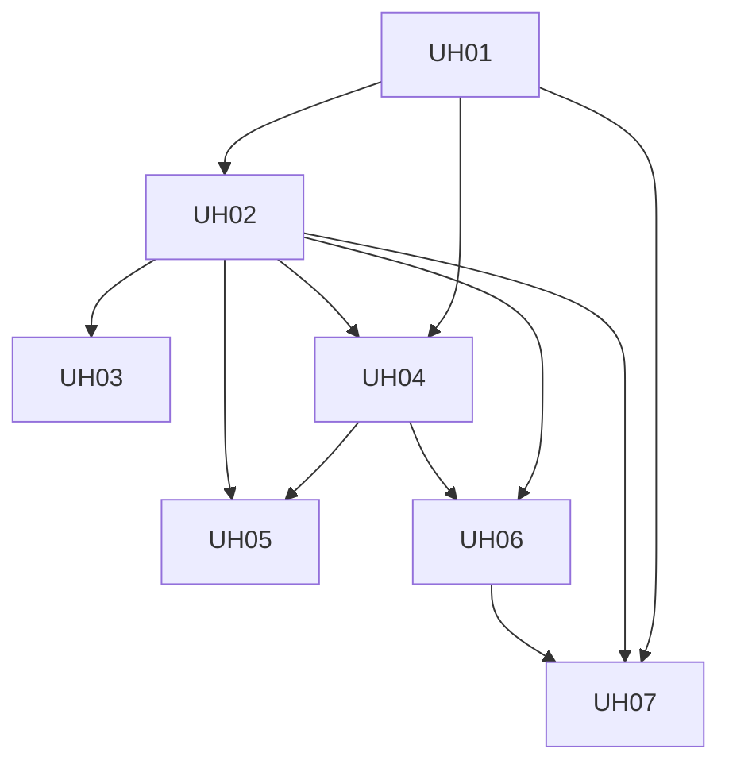

# Build Plan — Module Hôtel (UH)

Ordered units for the hotel module. Source: `context/project-overview.md` + README2 decomposition rules.

**Rules:** one visible result per unit · dependencies just-in-time · voyage `Paiement` untouched · no CashSession hard gate · obsolete B10 ignored.

| # | Spec file | Builds | Depends on | Visible when done |
|---|-----------|--------|------------|-------------------|
| UH01 | [UH01-room-board.md](./UH01-room-board.md) | Room inventory CRUD + day room board + KPIs + status updates | Branch HOTEL shell, `HotelRoomType`/`HotelRoom` | Réception sees full/free/ready/dirty/HS board |
| UH02 | [UH02-sejours.md](./UH02-sejours.md) | Stay model, assign room, check-in/out, folio nights | UH01 | Séjours staff flow works end-to-end |
| UH03 | [UH03-roles-shells.md](./UH03-roles-shells.md) | Reception / gérant / owner hotel views & permission gates | UH01, UH02 | Role-appropriate shells (no wrong menus) |
| UH04 | [UH04-fnb-menu-queue.md](./UH04-fnb-menu-queue.md) | Menu CRUD + staff order queue | UH01 (branch), UH02 (folio link optional) | Cuisine/service sees and advances orders |
| UH05 | [UH05-fnb-self-order.md](./UH05-fnb-self-order.md) | Guest self-order room + restaurant | UH04, UH02 for room context | Guest submits order; staff serves |
| UH06 | [UH06-encaissement.md](./UH06-encaissement.md) | Hotel payments on folio/F&B (CASH/MM/CARTE) | UH02, UH04 | Staff can settle folio without CashSession |
| UH07 | [UH07-pwa-booking.md](./UH07-pwa-booking.md) | PWA room search → draft → stub pay → confirmation | UH01, UH02, UH06 | Guest books room online |

## Explicitly deferred (not in this plan)

- CashSession open/close (ex-B08)
- Unified Payment migration with voyage (ex-B09)
- Boutique module
- OTA / channel manager
- Production Mobile Money provider
