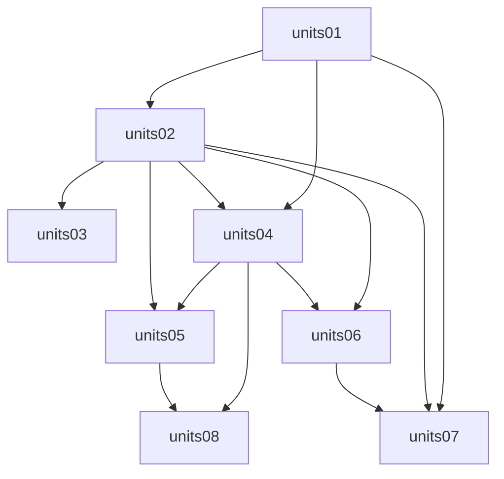

# Build Plan — Module Hôtel

Ordered units for the hotel module. Source: `context/project-overview.md`.

**Naming:** each unit lives at `context/specs/units-NN-feature.md`.

**Rules:** one visible result per unit · dependencies just-in-time · voyage `Paiement` untouched · no CashSession hard gate · obsolete B10 ignored · explain acronyms · **en ligne** = client self-service · **sur place** restauration = serveur → enregistrement Admin → chef.

## Two tracks

| Track | Units | Surface |
|-------|-------|---------|
| **Admin** (personnel) | 01–04, 06, parts of 03/08 | `app/admin/.../hotel/*` |
| **Client** (en ligne) | 05, 07, 08 | `app/(public)/[orgSlug]/hotel/…` → URLs `/{orgSlug}/hotel/…` — responsive + GSAP |

| # | Spec file | Builds | Depends on | Visible when done |
|---|-----------|--------|------------|-------------------|
| 01 | [units-01-room-board.md](./units-01-room-board.md) | Room inventory CRUD + day room board + KPIs + status updates | Branch HOTEL shell | Réception sees full/free/ready/dirty/HS board |
| 02 | [units-02-sejours.md](./units-02-sejours.md) | Stay model, assign room, check-in/out, folio nights | units-01 | Séjours staff flow works end-to-end |
| 03 | [units-03-roles-shells.md](./units-03-roles-shells.md) | Reception / serveur / gérant / owner shells & permission gates | units-01, units-02 | Role-appropriate Admin shells |
| 04 | [units-04-fnb-menu-queue.md](./units-04-fnb-menu-queue.md) | Menu CRUD + **staff order entry** (sur place) + kitchen queue + table inventory prep | units-01, units-02 recommended | Serveur/enregistreur + chef queue work |
| 05 | [units-05-fnb-online-order.md](./units-05-fnb-online-order.md) | Client **en ligne** food (room service if stay; plats tied to table booking when units-08 exists) | units-04, units-02 | Guest orders food online; kitchen sees it |
| 06 | [units-06-encaissement.md](./units-06-encaissement.md) | Hotel payments on folio/F&B (CASH/MM/CARTE) | units-02, units-04 | Staff can settle folio without CashSession |
| 07 | [units-07-room-booking.md](./units-07-room-booking.md) | Client **en ligne** room search → draft → **auth** → stub pay → confirmation | units-01, units-02, units-06 | Guest books room online with account (responsive + GSAP) |
| 08 | [units-08-table-reservation.md](./units-08-table-reservation.md) | Table at a set time: alone **or with food**; Client en ligne (+ Admin if needed) | units-04, units-05 for food lines | Guest books table ± food online |

## Explicitly deferred (not in this plan)

- CashSession open/close (ex-B08)
- Unified Payment migration with voyage (ex-B09)
- Boutique module
- OTA / channel manager
- Production Mobile Money provider
- Dining-room guest self-order replacing the serveur
