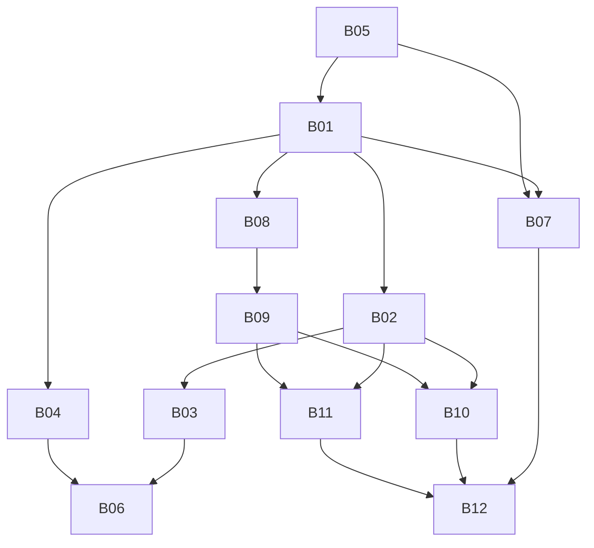

# Units d’exécution — Multi-branches Coccinelle

Découpage exécutable de [`../plan-multi-branches.md`](../plan-multi-branches.md).  
Chaque unit = livrable **visible** + **testable**. Suivre l’ordre strict.

---

## Règle d’exécution (obligatoire)

1. Lire la unit en entier + les § concernés du plan multi-branches.  
2. Skills Prisma / Better Auth / shadcn listés → les suivre.  
3. MCP Better Auth avant toute nouvelle permission.  
4. Critères d’acceptation cochés un par un → `status: done`.  
5. Ne pas anticiper les units hors dépendances.  
6. Toute query métier : filtre `organizationId` (+ `branchId` dès B05).

### Prérequis environnement

| Étape | Action |
|-------|--------|
| P0 | Garde le user **app admin** (`role = admin`) pour les tests |
| P0 | Purge le reste des données métier / orgs / membres seed |
| P0 | Créer une Organization → enchaîner création de **Branch** (type) + **bootstrap** |

---

## Ordre d’exécution

| # | Unit | Phase | Dépend | Visible / testable | Status |
|---|------|-------|--------|--------------------|--------|
| B01 | [Schéma Branch + BranchMember](./B01-schema-branch.md) | B0 | — | Tables + enum types | `done` |
| B02 | [Bootstrap par type de branche](./B02-bootstrap-branche.md) | B0 | B01 | Créer branche → données initiales AGENCE/HOTEL/BOUTIQUE | `done` |
| B03 | [Création org → branches](./B03-org-creer-branches.md) | B0 | B01, B02 | Après create org : UI choisir type(s) + créer | `done` |
| B04 | [BranchMember + permissions branch](./B04-branch-member-permissions.md) | B0 | B01 | Affecter staff ; `branch:*` Better Auth | `todo` |
| B05 | [Purge & seed admin only](./B05-purge-admin-only.md) | B0 | — | DB propre sauf user admin | `done` |
| B06 | [activeBranch + sélecteur](./B06-active-branch-ui.md) | B0 | B03, B04 | Switch de branche post-login | `todo` |
| B07 | [Scoper voyage sur branchId](./B07-voyage-branch-scope.md) | B1 | B01, B05 | Guichet/gérant filtrés par branche | `todo` |
| B08 | [CashSession](./B08-cash-session.md) | B2 | B01 | Ouvrir / clôturer caisse | `todo` |
| B09 | [Payment unifié](./B09-payment-core.md) | B2 | B08 | Encaisser sur docs métier | `todo` |
| B10 | [Hôtel MVP](./B10-hotel-mvp.md) | B3 | B02, B09 | Chambres + séjour + paye | `todo` |
| B11 | [Boutique MVP](./B11-boutique-mvp.md) | B4 | B02, B09 | POS + stock | `todo` |
| B12 | [Rapports multi-branches](./B12-rapports-consolides.md) | B5 | B07–B11 | CA consolidé owner | `todo` |
| B13 | [Modules hôtellerie-restaurant](./B13-hospitalite-modules.md) | B3+ | B01–B03, B10 | Création modules séjours ± resto ; type RESTAURANT | `done` |
| B14 | [Modules Agence & Boutique](./B14-agence-boutique-modules.md) | B0+ | B01–B03 | Avion/Bus/Bateau · Pharmacie/Boutique/Alimentation | `done` |
| B15 | [Branche Usine](./B15-usine.md) | B4+ | B01–B03, B11, paie, stock service | Eau/vins · crédit · marketeur · paie commerce | `done` |

> **Ordre pratique immédiat :** B05 (purge) ∥ B01 (schéma) → B02 → B03 → B04 → B06…

---

## Smoke test immédiat (B0 livré)

1. Connexion avec `kilemmarxweber@gmail.com` (admin).  
2. Admin → Organisations → **Créer** → redirect « Nouvelle branche ».  
3. Choisir type **Agence / Hôtel / Boutique**, nom + code, cocher démo → Créer.  
4. Vérifier liste branches + compteurs ; bouton **Dashboard** →  
   `/admin/organizations/[orgId]/branches/[branchId]`.

**Prochaine unit :** [B04](./B04-branch-member-permissions.md) (affectations + `branch:*`).  
**Dashboard dynamique :** [PLAN-dashboard-dynamique.md](./PLAN-dashboard-dynamique.md) (D01–D02 livrés côté nav ; D03–D06 = B08–B11).  
**Hôtel (caisse · séjours · resto) :** [`../plan-hotel-caisse-sejours-restauration.md`](../plan-hotel-caisse-sejours-restauration.md) — phases H0→H5, cartes Dashboard only.  
**Hôtellerie-restaurant (modules Hôtel / Restaurant) :** [`../plan-hospitalite-modules-hotel-restaurant.md`](../plan-hospitalite-modules-hotel-restaurant.md) — séjours ± restaurant, type `RESTAURANT`, livraison commune.  
**Agence & Boutique (modules) :** [`../plan-agence-boutique-modules.md`](../plan-agence-boutique-modules.md) — Avion/Bus/Bateau · Pharmacie/Boutique/Alimentation.  
**Usine (eau / vins · crédit · marketeur) :** [`../plan-usine-production-commerce.md`](../plan-usine-production-commerce.md) — type `USINE`, paie comme boutique, stock comme resto, [B15](./B15-usine.md).  
**Séjour — Note de chambre :** [`../plan-sejour-note-chambre.md`](../plan-sejour-note-chambre.md) — Comptant vs Sur note · consommations sur facture séjour.  
**Rôles custom + équipe branche :** [`../plan-roles-custom-dynamiques.md`](../plan-roles-custom-dynamiques.md) — units [`../units-roles/INDEX.md`](../units-roles/INDEX.md) (R01→R07).

---

## Personas de test (après purge)

| Persona | Compte | Rôle | Usage |
|---------|--------|------|-------|
| Super-admin / owner plateforme | User conservé (`role=admin`) | `APP_ROLE.admin` | Crée les orgs + branches |
| Staff / clients | À recréer via UI | — | Pas de seeds auto après purge |

---

## Lien plan produit

Détail métier, cashpaye, migration : [`../plan-multi-branches.md`](../plan-multi-branches.md).
