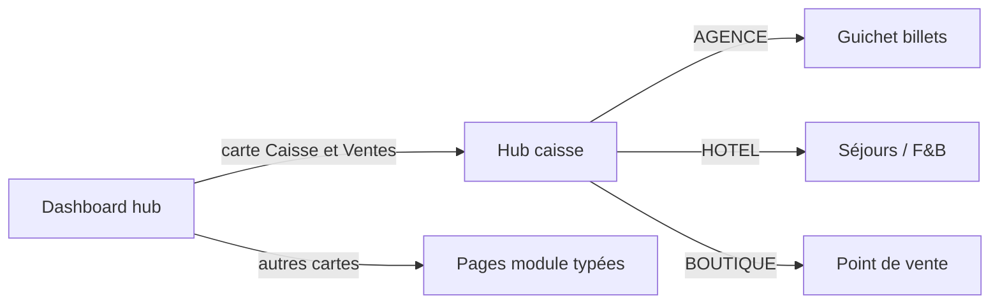

# Plan — Dashboard dynamique par `BranchType`

**Statut :** exécutable  
**Base URL :** `/admin/organizations/[organizationId]/branches/[branchId]`  
**Principe :** le hub et les cartes changent selon `AGENCE` | `HOTEL` | `BOUTIQUE` ; chaque carte mène à un écran métier réel (pas de `#`).

---

## 1. Objectif produit

> Entrer dans une branche → voir **uniquement** les actions de ce type → cliquer une carte → **accéder au contenu** et **effectuer l’opération** (ex. Caisse & Ventes → ouvrir / utiliser la caisse et vendre).

| Type | Intention dashboard | Carte « Caisse & Ventes » mène à |
|------|---------------------|----------------------------------|
| `AGENCE` | Guichet voyage | Hub caisse → CTA **Vendre un billet** → `…/agence/reservations/guichet` |
| `HOTEL` | Réception / F&B | Hub caisse → CTA **Encaisser séjour / F&B** → `…/hotel/sejours` (puis resto) |
| `BOUTIQUE` | POS retail | Hub caisse → CTA **Nouvelle vente POS** → `…/boutique/pos` |

Le hub **`…/caisse`** est **partagé** (core cashpaye) mais **oriente** la vente selon le type.

**Commun à tous les types** (comme l’ancien dashboard) :

- **Taux de Change** → `…/taux-change`
- **ANALYSES & RAPPORTS** → tableau de bord, ventes, achats, financier, article

---

## 2. Architecture UI

```text
branches/[branchId]/                    HUB dynamique (cartes = f(type))
├── caisse/                              Core : session + lien « Effectuer une vente »
├── agence/…                             Verticale voyage
├── hotel/…                              Verticale hôtel
└── boutique/…                           Verticale retail
```



**Sources de vérité code**

| Fichier | Rôle |
|---------|------|
| `lib/branch/branch-menus.ts` | Cartes du hub selon type |
| `lib/branch/paths.ts` | URLs stables |
| `lib/branch/require-branch-context.ts` | Auth + garde de type |
| `…/caisse/page.tsx` | Hub caisse dynamique + CTA vente |

---

## 3. Cartes par type (contrat)

### 3.1 AGENCE

| Carte | Route | Contenu cible |
|-------|-------|----------------|
| **Caisse & Ventes** | `…/caisse` | Session + vente billets |
| Guichet (raccourci) | `…/agence/reservations/guichet` | Formulaire vente |
| Réservations | `…/agence/reservations` | Liste dossiers |
| Trajets | `…/agence/trajets` | Lignes / tarifs |
| Colis | `…/agence/colis` | Expéditions |
| Embarquement | `…/agence/passages` | Scan QR |
| Clients | `…/agence/clients` | Portefeuille |

### 3.2 HOTEL

| Carte | Route | Contenu cible |
|-------|-------|----------------|
| **Caisse & Ventes** | `…/caisse` | Session + encaisser séjour |
| Séjours | `…/hotel/sejours` | Check-in / out |
| Chambres | `…/hotel/chambres` | Inventaire |
| Restauration | `…/hotel/restauration` | Commandes F&B |

### 3.3 BOUTIQUE

| Carte | Route | Contenu cible |
|-------|-------|----------------|
| **Caisse & Ventes** | `…/caisse` | Session + POS |
| Point de vente | `…/boutique/pos` | Panier / ticket |
| Produits | `…/boutique/produits` | Catalogue |
| Stock | `…/boutique/stock` | Mouvements |

---

## 4. Units d’implémentation (ordre)

| # | Livrable | Dépend | Done when |
|---|----------|--------|-----------|
| **D01** | Menus hub = cartes liées (plus de `#`) + carte primaire **Caisse & Ventes** | Structure modules | Clic → bonne URL |
| **D02** | Hub `caisse` dynamique : titre + CTA « Effectuer une vente » selon type | D01 | CTA → guichet / séjours / POS |
| **D03** | Session caisse (ouvrir / clôturer) — B08 | D02 | État caisse visible |
| **D04** | Brancher vente AGENCE (migrer guichet legacy → `agence/…`) — B07 | D02 | Vente réelle depuis CTA |
| **D05** | Brancher vente BOUTIQUE POS — B11 | D02, D03 | Ticket depuis CTA |
| **D06** | Brancher vente HOTEL — B10 | D02, D03 | Encaissement séjour |

> **D01 + D02** = ce sprint (navigation dynamique).  
> **D03–D06** = métier cashpaye + modules (déjà dans INDEX B07–B11).

---

## 5. Critères d’acceptation (D01–D02)

1. Branche `AGENCE` : hub montre cartes voyage ; **Caisse & Ventes** → `/caisse` ; CTA → guichet.  
2. Branche `HOTEL` : cartes hôtel uniquement ; CTA → séjours.  
3. Branche `BOUTIQUE` : cartes boutique ; CTA → POS.  
4. Ouvrir `/hotel/…` sur une AGENCE → redirect hub.  
5. Aucune carte du hub avec `href: "#"`.

---

## 6. Hors scope immédiat

- KPI / graphiques avancés  
- Permissions fines par carte (B04)  
- Migration complète du legacy `/agences` (D04 / B07)

---

## Lien

Structure dossiers : [`STRUCTURE-modules-branche.md`](./STRUCTURE-modules-branche.md)  
Plan produit : [`../plan-multi-branches.md`](../plan-multi-branches.md)
