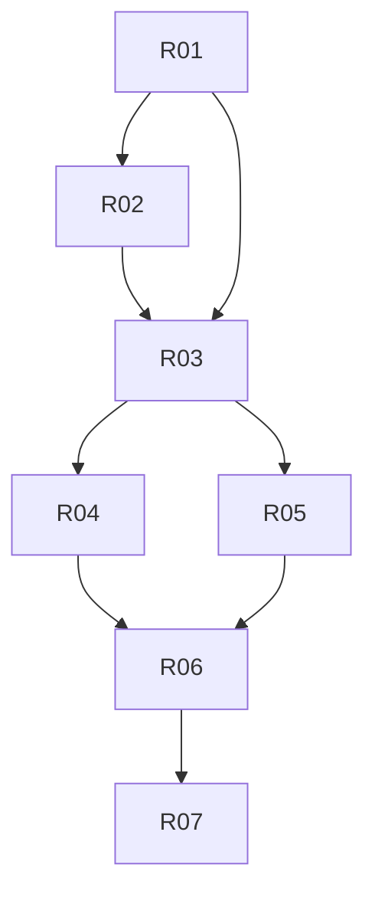

# Units — Rôles custom dynamiques

Découpage exécutable de [`../plan-roles-custom-dynamiques.md`](../plan-roles-custom-dynamiques.md).  
Chaque unit = livrable **visible** + **testable**. Suivre l’ordre.

---

## Règle d’exécution (obligatoire)

1. **Lire la unit** en entier avant de coder.
2. **Lire les skills** listés + consulter MCP **user-better-auth** pour DAC / `hasPermission` / `createOrgRole`.
3. **Vérifier les critères d’acceptation** un par un → `status: done`.
4. **Ne pas anticiper** les units suivantes hors dépendances.
5. Permissions = Better Auth uniquement. Interdit : `if (role === "…")` comme seule autorité.

### Skills & MCPs

| Type | À utiliser |
|------|------------|
| Skill | `better-auth-best-practices`, `organization-best-practices`, `better-auth-security-best-practices` |
| Skill | `prisma-cli` / `prisma-client-api` si seed / migration |
| Skill | `shadcn` pour UI matrice / équipe |
| Skill | `next-dev-loop` après UI |
| MCP | `user-better-auth` — Dynamic Access Control, org roles |
| MCP | `project-0-coccinelle-shadcn` — Switch, Table, etc. |

---

## Ordre d’exécution

| # | Unit | Dépend | Visible / testable | Status |
|---|------|--------|--------------------|--------|
| R01 | [Catalogue permissions FR](./R01-catalogue-permissions-fr.md) | — | Statements AC + libellés FR (99) | `done` |
| R02 | [Seed presets + migration](./R02-seed-presets-migration.md) | R01 | Presets caissier/serveur/… en `OrganizationRole` | `done` |
| R03 | [CRUD rôles org + matrice](./R03-crud-roles-matrice-org.md) | R01, R02 | UI `/roles` éditable ; owner verrouillé | `done` |
| R04 | [Équipe par branche — users](./R04-equipe-branche-users.md) | R03 | Hub branche : créer user + assigner rôle | `done` |
| R05 | [Rôles depuis la branche](./R05-roles-depuis-branche.md) | R03 | Hub branche : créer/éditer rôle (stocké org) | `done` |
| R06 | [Enforcement pages & actions](./R06-enforcement-pages-actions.md) | R01, R04 | Hub/pages/actions sur catalogue (plus ROLE_CARDS) | `done` |
| R07 | [Tests & critères globaux](./R07-tests-acceptation.md) | R04–R06 | Suite tests + checklist E2E | `done` |

---

## Rôles système (rappel)

- Plateforme : `admin`, `user`
- Org : `owner` (créateur) — **pas** un custom
- Tout le reste = custom DAC
