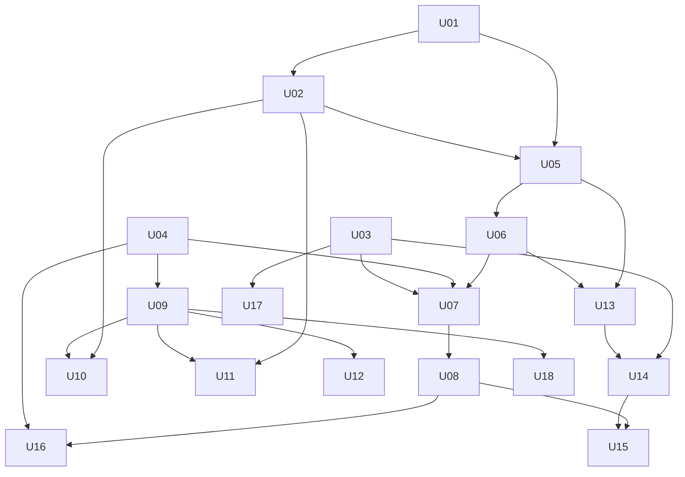

# Units d’implémentation — Restructuration réservation

Découpage de [`../plan-restructuration-reservation.md`](../plan-restructuration-reservation.md) en **units** : chaque unit livre une fonctionnalité **visible** et **testable** indépendamment (avec ses dépendances).

---

## Règle d’exécution (obligatoire)

Lors de l’implémentation d’une unit, l’agent doit :

1. **Lire la unit** concernée en entier avant de coder.
2. **Lire les skills** listés dans la unit (fichiers `SKILL.md`) et les suivre.
3. **Consulter les MCPs** listés (lire le schéma de l’outil MCP avant chaque appel).
4. **Vérifier les critères d’acceptation** un par un avant de marquer la unit `done`.
5. **Ne pas anticiper** les units suivantes hors dépendances strictes.

---

## Permissions = Better Auth uniquement

Toute autorisation passe par **Better Auth** (plugin **organization** + access control). Pas de RBAC parallèle.

| Rôle produit | Slug Better Auth | Responsabilité |
|--------------|------------------|----------------|
| **Owner** | `owner` | Crée l’organisation, la supervise (super-admin **de l’org**) |
| **Gérant** | `gestionnaire` | Gère l’agence (trajets, planning, tarifs, équipe, rapports) — **ne crée pas** l’org |
| **Guichetier** | `guichetier` | Comptoir : réservation billets, encaissement, embarquement |
| **Client** | `parent` | Self-service en ligne |
| Super-admin plateforme | `APP_ROLE.admin` | Toutes les orgs (plugin admin) — distinct de `owner` |

> Mapping corrigé : ~~Gérant≠owner~~ · ~~Guichetier≠gestionnaire~~. Détail : [U04](./U04-permissions-guichetier.md).

**Implémentation de référence :**

- `lib/permissions.ts` — `createAccessControl`, `organizationRoles` (+ slug `guichetier`)
- `lib/auth.ts` — `organization({ roles, allowUserToCreateOrganization })`
- `lib/auth/organization-permission.ts` — helper générique `hasPermission`
- `lib/auth/inscription-permission.ts` — `inscription:*` via helper
- Labels UI : Owner / Gérant / Guichetier / Client (`lib/org-role-labels.ts`)

**Règles pour toutes les units :**

1. Avant d’ajouter une permission : MCP `user-better-auth` + skills Better Auth / organization.
2. Déclarer dans `accessControlStatements` / `organizationRoleStatements`, puis `organizationRoles`.
3. Gate serveur = `hasPermission` (ou helper). Interdit : `if (role === "…")` comme seule autorité.
4. U04 est le socle ; U07/U09/U12/U15/U16/U18 réutilisent cette grille.

### Skills projet (racine `.agents/skills/`)

| Domaine | Skills à privilégier |
|---------|----------------------|
| Prisma / BDD | `prisma-cli`, `prisma-client-api`, `prisma-database-setup`, `prisma-upgrade-v7` |
| Auth / rôles | `better-auth-best-practices`, `organization-best-practices`, `better-auth-security-best-practices`, `create-auth` |
| UI | `shadcn` |
| Next.js runtime | `next-dev-loop` (vérifier en `next dev` après changements UI) |

### MCPs projet

| MCP | Usage |
|-----|--------|
| `user-Prisma` | Doc Prisma (`search_prisma_documentation`), introspection / SQL si besoin |
| `user-better-auth` | **Obligatoire** pour permissions : `search_docs` → `get_doc` (organization access control, `hasPermission`, roles) |
| `project-0-coccinelle-shadcn` | Chercher / ajouter composants UI (`search_items_in_registries`, `get_add_command_for_items`, exemples) |

---

## Ordre d’exécution

| # | Unit | Phase | Dépend de | Visible / testable |
|---|------|-------|-----------|--------------------|
| 01 | [Mode transport BUS / AVION](./U01-mode-transport.md) | A | — | Badge + filtre bus/avion sur trajets `done` |
| 02 | [Capacité & anti-surbooking](./U02-capacite-places.md) | A | U01 | Places restantes + refus si plein `done` |
| 03 | [Destinataire colis](./U03-destinataire-colis.md) | A | — | Champs destinataire au guichet `done` |
| 04 | [Permissions rôles org](./U04-permissions-guichetier.md) | A | — | owner / gérant / guichetier / client via Better Auth `done` |
| 05 | [Moteur recherche départs](./U05-moteur-recherche-departs.md) | A | U01, U02 | API/action résultats avec prix & places `done` |
| 06 | [Kit composants funnel](./U06-kit-composants-funnel.md) | B | U05 | Story / page démo funnel réutilisable `done` |
| 07 | [Guichet V2 + vente express](./U07-guichet-v2-vente-express.md) | B | U03–U06 | Nouveau parcours vente testable E2E `done` |
| 08 | [Billet PDF / QR / impression](./U08-billet-pdf-qr.md) | B | U07 | PDF + QR sur fiche réservation `done` |
| 09 | [Shell navigation gérant](./U09-shell-gerant.md) | C | U04 | Espace `/…/gerant` distinct `done` |
| 10 | [Dashboard gérant KPI](./U10-dashboard-gerant.md) | C | U09, U02 | KPI réels (plus de mock) `done` |
| 11 | [Planning départs gérant](./U11-planning-departs.md) | C | U09, U02 | Ouvrir/fermer/capacité visibles `done` |
| 12 | [Réservations & rapports gérant](./U12-reservations-rapports-gerant.md) | C | U09 | Filtres + CA basique `done` |
| 13 | [PWA recherche & résultats](./U13-pwa-recherche-resultats.md) | D | U05, U06 | `/[orgSlug]` recherche publique `done` |
| 14 | [PWA checkout draft](./U14-pwa-checkout-draft.md) | D | U13, U03 | Draft + passagers + colis `done` |
| 15 | [PWA paiement & mes billets](./U15-pwa-paiement-mes-billets.md) | D | U14, U08 | Confirmation + historique client `done` |
| 16 | [Embarquement QR](./U16-embarquement-qr.md) | E | U08, U04 | Scan → statut EMBARQUE `done` |
| 17 | [Gestion colis réelle](./U17-gestion-colis.md) | E | U03 | Statuts colis non mock `done` |
| 18 | [Admin plateforme & branding](./U18-admin-branding.md) | F | U09 | Admin ≠ agence ; marque Coccinelle `done` |

---

## Statuts

Chaque unit porte un champ `status` : `todo` | `in_progress` | `done` | `blocked`.

Mettre à jour le statut dans le fichier unit **et** dans le tableau ci-dessus lors du démarrage / fin.
